# Python3入门教程

[TOC]

## 入门知识

### 什么是Python？

Python是一种高级、通用的、解释型、面向对象的编程语言。

#### 何为高级语言？

> **高级语言**是面向过程/对象的语言，开发人员只要按照高级语言的语法规则编写代码，通过编译/解释就能对计算机硬件进行操作，并不需要我们了解计算机的细节以及它是如何实现的。
>
> 与之相对的，是低级的机器语言和汇编语言。
>
> **机器语言**是计算机直接识别并执行的二进制指令集，是一串串的0和1，其中0代表低电平，1代表高电平，通过控制高低电平来操控计算机硬件。
>
> **汇编语言**是二进制指令的文本形式，与二进制指令是一一对应的关系。比如：加法指令`00000011`写成汇编语言就是`ADD`。

#### 何为通用的？

> **通用编程语言**是服务于各种应用领域的编程语言，这就意味着你能够用Python做很多事情：
>
> - Web应用程序
>
> - 数据分析
>
> - 数据科学
>
> - 机器学习
>
> - 人工智能
>
> - 移动应用
>
>   ……
>
> 语言只是实现目的的工具，每一门语言都有它所擅长的领域，在开发时应选择合适的语言从而提高开发效率。

#### 何为解释型？

> 计算机无法直接识别高级语言，因为计算机本质上是一个时序逻辑电路，而对电路而言只有高电平和低电平。所以必须要把高级语言翻译成能被计算机直接识别的机器语言机器，才能执行高级语言编写的程序。
>
> 翻译的方式有两种：一种是编译，一种是解释。
>
> 编译的过程：**编译型语言->二进制文件->直接执行二进制文件**
>
> 解释的过程：**解释性语言->一边解释一边执行**
>
> 我们可以从现实生活中的例子，来理解编译和解释的过程：
>
> **编译型语言**将代码一次性“翻译”成由许多指令组成的二进制文件，计算机一条指令一条指令的执行。
>
> **解释性语言**就是随身携带一个翻译官（解释器）一边“翻译”一边执行。

#### 何为面向对象？

> **面向对象**（Object Oriented）是将现实问题构建关系，然后抽象成类（class），给类定义和方法后，再将类实例化成实例（instance），通过访问实例的属性和调用方法进行使用。
>
> 在Python中“类”和“类的实例”都称为对象（Object），因为Python里的类都继承了一个object类。在Java等静态语言中，一般把类的实例称为对象。
>
> 面向对象有三大特征：**封装**、**继承**、**多态**，在后面我们一一进行了解。
>
> 在编程的世界中，还有一种编程思想叫**面向过程**（Procedure Oriented）。面向过程是将现实问题分解成一个个详细的步骤，然后通过函数实现每一个不走，并依次调用。

#### 安装Python

##### 在Windows上安装Python

第一步：首先需要你需要前往Python官网下载[最新版本的Python](https://www.python.org/downloads/)，然后双击安装程序以启动安装向导。

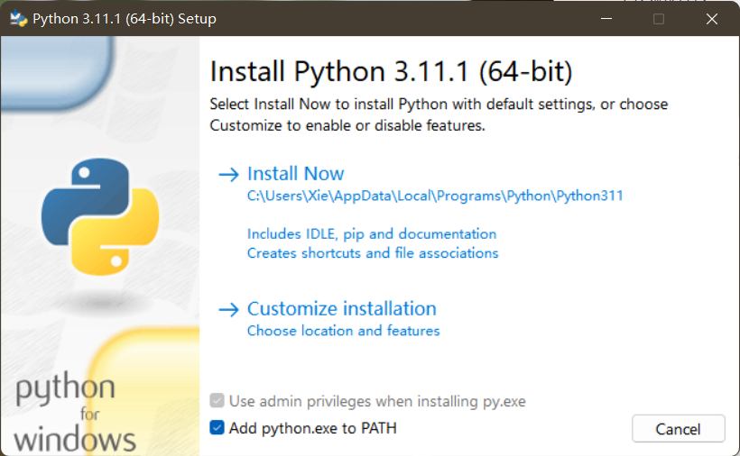

第二步：在安装之前需要勾选以下设置，然后点击`Install Now`，你也可以通过`Customize installation`进行自定义安装。

- [x] Add python.exe to Path

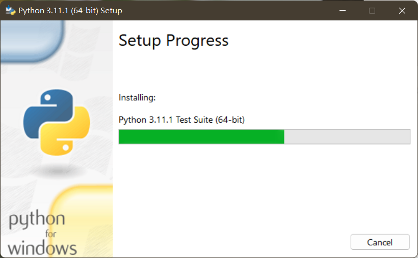

稍等片刻，直到出现`Setup was succseeful`表示安装成功。

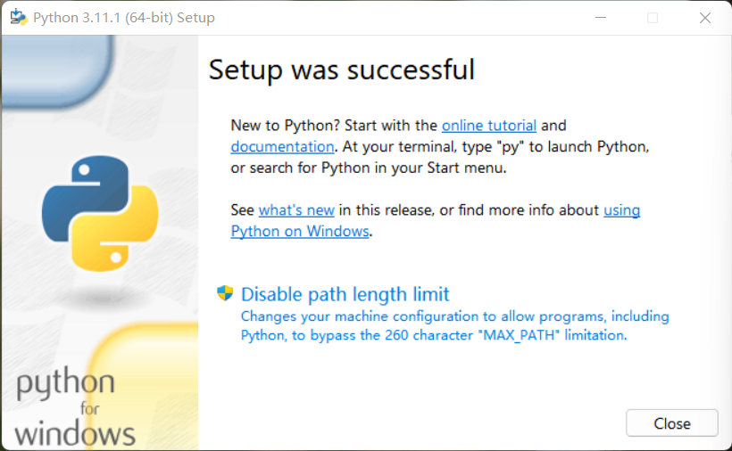

我们可以通过快捷键`Win+R`->确定，打开命令行窗口。

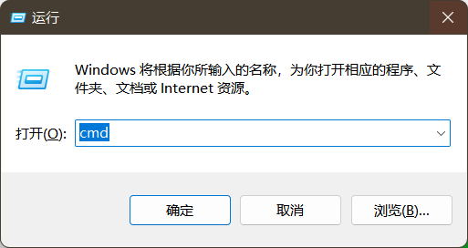

在命令行窗口输入`python`->按下回车，以此来验证Python是否安装成功。

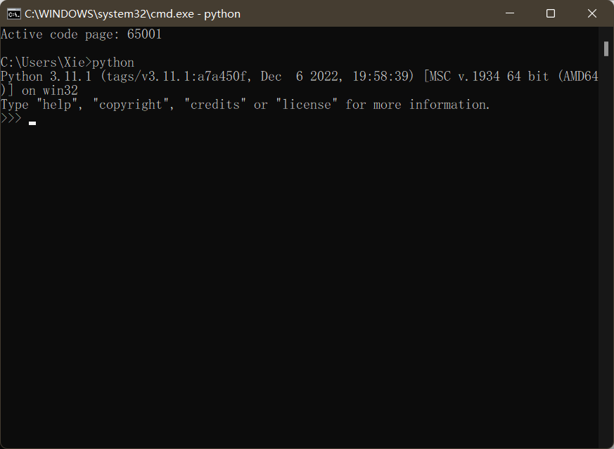

如果你看到类似上图的输出，表示你已成功在你的`Windows`计算机上安装了`Python3.11.1`。

##### 在macOS上安装Python

第一步：下载[适用于macOS的Python](https://www.python.org/downloads/macos/)版本

第二步：双击安装文件来运行安装向导

第三步：按照提示进行安装，直到安装完成

##### 在Linux上安装Python

一般来说，Linux自带了Python，你可以在终端输入以下命令来检查：

```shell
python3 --version
```

打开终端，输入以下命令进行安装：

```shell
sudo apt install python3.11
```

### 第一个Python程序

在编写你的第一个Python程序之前，你需要了解Python是如何运行你编写的代码的。

#### Python程序执行过程

> 1. 执行`.py`文件（会启动Python解释器）
> 2. 编译器将源文件解释成字节码
> 3. 虚拟机将字节码转化成机器语言，与操作系统交互
> 4. 程序运行结束后，将字节码存到`.pyc`文件。

#### Python解释器

就像我们在语言不通的情况下和外国人交流需要一名翻译官一样，Python和计算机之间的“交流”也需要一个“翻译”，我们称这个“翻译”为`Python解释器`。

Python解释器有很多种，但是主流的还是`CPython`。

| 解释器       | 介绍                                                 |
| ------------ | ---------------------------------------------------- |
| `CPython`    | 由C语言开发，默认的解释器                            |
| `IPython`    | 基于`CPython`的交互式解释器                          |
| `PyPy`       | 采用`JIT`技术，动态编译，追求执行速度                |
| `JPython`    | 运行在Java平台上的解释器，可直接编译成Java字节码执行 |
| `IronPython` | 运行在.Net平台上的解释器                             |

#### 使用IDLE编写第一个Python程序

如果我们想要写一个简单的Python程序，就需要使用到开发环境包里的一个工具——`IDE（Integrated Development Environment）`。


打开它，你会看到这样一个界面：

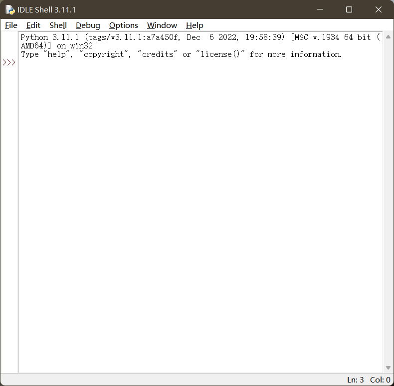

选中菜单中的`File`->`New File`，或者使用快捷键`Ctrl+N`，然后就会打开一个空白的窗口，就像你打开了一个新的Word文档一样，接下来你可以在这里敲下你的代码。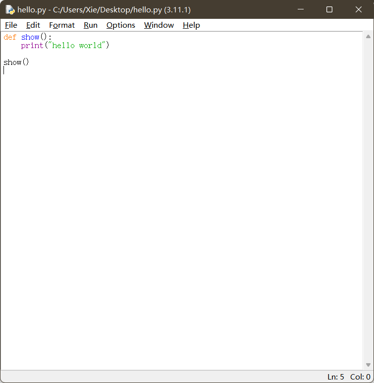

按下`Ctrl+S`保存你的代码，我们可以试着去运行。选中菜单中的`Run`->`Run Module`，或者按`F5`。


#### 第三方IDE——PyCharm

有一句老话说“老话说的好，工欲善其事必先利其器”，Python也有很多花里胡哨的第三方Python开发工具——`PyCharm`。

安装PyCharm

[按住Alt点我直达官网](https://www.jetbrains.com/pycharm/)->点击`DownLoad`->选择版本（仅学习的话可以使用`Community`社区版本）->下载安装。

##### 创建新项目

安装完成打开它你将会看到这样一个界面：

点击`New Project`来创建一个新项目：

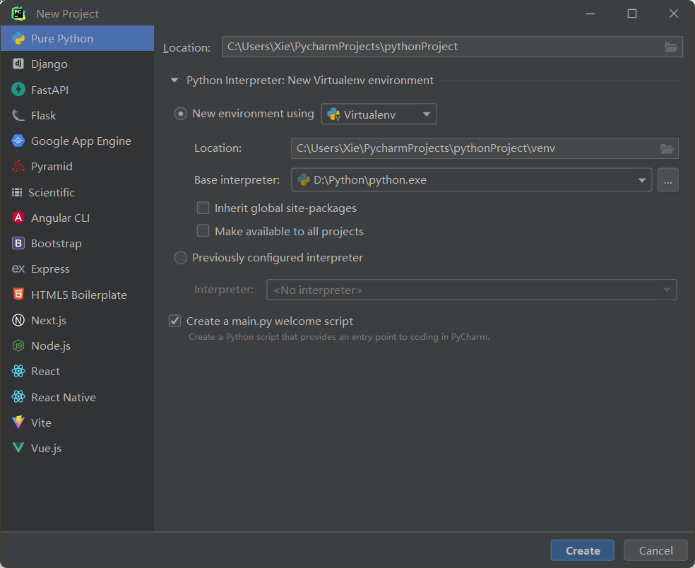

我们可以设置项目的位置：

设置Python解释器：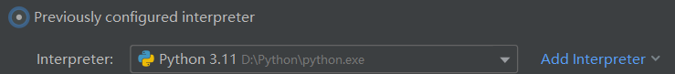

如果没有Python解释器，可以点击蓝字 `Add interpreter`进行添加，一般我们选`Add Local Interpreter`就行。

然后我们点击`System Interpreter`，点击那三个点，选取Python安装目录下Tools文件夹下的`python.exe`(也就是解释器的位置)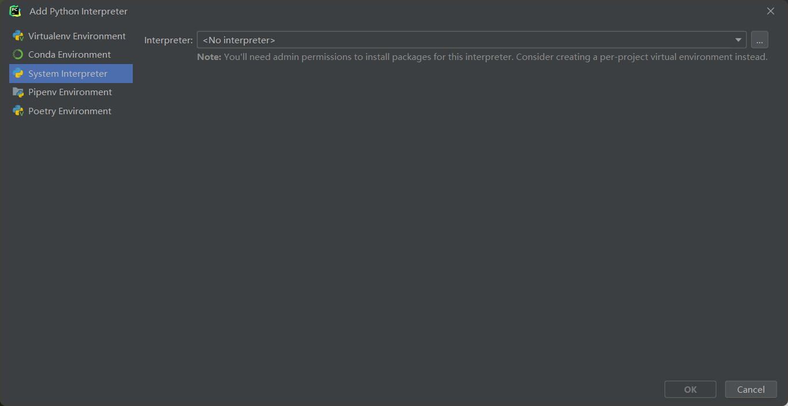

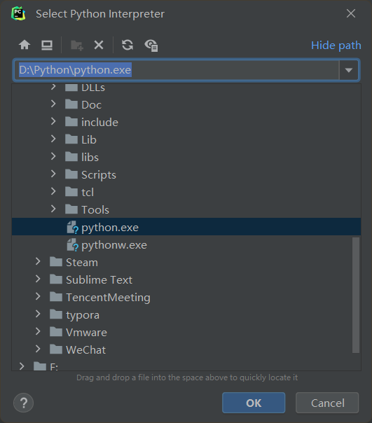

我们可以把`Create a main.py welcome script`勾选上，这样`PyCharm`会默认创建一个`main.py`,这个可勾选可不勾选，看心情。然后按下`Create`，一个空白项目就创建了！

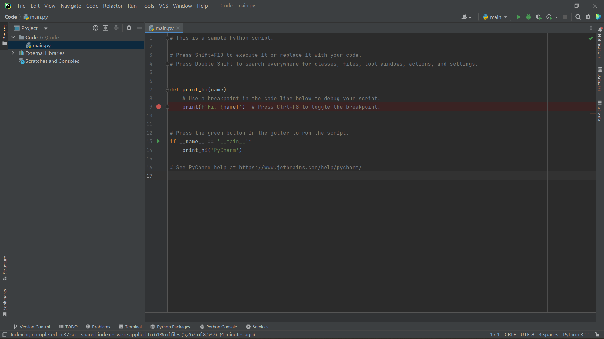

同刚才的`IDLE`相比的话，`PyCharm`就显得高大上许多了，但是它们的主要功能是相同的。

因为我们勾选了`Create a main.py welcome script`，所以可以看到自动生成的一些代码，如果我们没有勾选这个选项，也可以自己新建一个空白Python文件。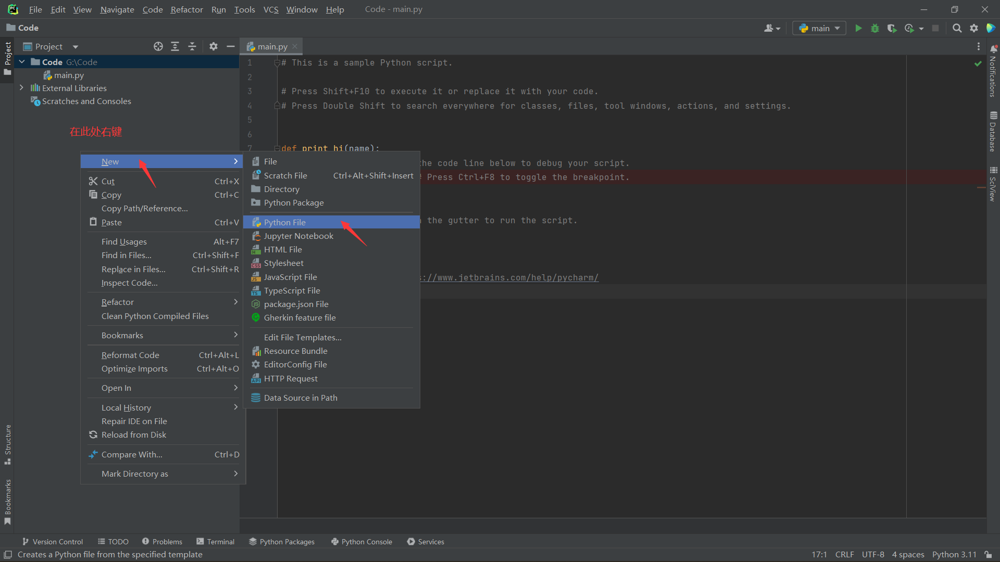

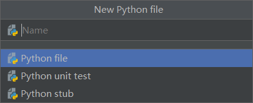

输入文件名后，按下`Enter`，一个空白的Python文件就创建好了，这下是真的空白了，什么都没有的那种空白。然后我们就可以开始敲代码了，但……并不了解Python 语法的我们是无从下手的。

### 变量

> 变量就是计算机编程语言用于放置信息的盒子

例如：

```python
name = "蔡徐坤"
#创建一个变量名为"name"、值为"蔡徐坤"的变量
age = 25
#创建一个变量名为"age"、值为"25"的变量
sex = "男"
#创建一个变量名为"sex"、值为"男"的变量
birthday = "1998-8-2"
#创建一个变量名为"birthday"、值为"1998-8-2"的变量
introduction = """蔡徐坤（KUN），1998年8月2日出生于浙江省温州市，户籍湖南吉首，中国内地男歌手、演员、原创音乐制作人 、MV导演"""
#在Python里注释用"#"
#在计算机编程语言里"="一般不是数学上的等于，我们称为赋值
```

### 数据结构

> 把一些有隐含关系的变量聚集在一起，形成一个新的变量个体，就是数据结构要解决的问题。

例如：`sing`、`jump`、`rap`、`basketball`之间存在某一种联系，我们创建一个`list`来存储。

```python
sing = "唱"
#创建一个变量名为"sing"、值为"唱"的变量
jump = "跳"
#创建一个变量名为"jump"、值为"跳"的变量
rap = "Rap"
#创建一个变量名为"rap"、值为"Rap"的变量
basketball = "篮球"
#创建一个变量名为"basketball"、值为"篮球"的变量
list_chicken = [sing,jump, rap, basketball]
#创建一个列表名为"list_chicken"、值为"sing,jump, rap, basketball"的列表
print(list_chicken)
#输出列表名为list_chicken的列表
```

当然数据结构远不止列表（list）这一种，但list非常常用。

### 运算

#### 算术运算

简单了说就是通过运算符将运算符两边的数据进行加减乘除这样的数学运算，常用的算术运算有：

| 算数运算符 | 操作                         |
| ---------- | ---------------------------- |
| +          | 加法运算                     |
| -          | 减法运算                     |
| *          | 乘法运算                     |
| /          | 除法运算                     |
| %          | 取模运算：两数相除，返回余数 |
| **         | 幂次运算                     |
| //         | 相除后，向下取整数           |

#### 比较运算

用来比较运算符两边信息的，比大小、比相同等。比较的结果只会有两种，是或否。

| 运算符 | 描述                   |
| ------ | ---------------------- |
| ==     | 判断两个数字是否相等   |
| !=     | 判断两个数字是否不相等 |
| >      | 大于比较符             |
| <      | 小于比较符             |
| >=     | 大于或等于比较符       |
| <=     | 小于或等于比较符       |

#### 逻辑运算

| 符号 | 意义          |
| ---- | ------------- |
| and  | 全真才真      |
| or   | 全假才假      |
| not  | 真变假 假变真 |

例如：

```python
I = True
you = False
love = I and you
print(love)
love = I or you
print(love)
print(not I)
print(not you)
```

输出结果：

> False
> True
> False
> True

### 语法结构

#### 顺序结构

从宏观来看，计算机能够同时满足用户听歌、打游戏的功能；但从微观来说，计算机CPU是一行一行执行指令的，之所以用户感觉计算机是同时处理的，是因为计算机处理的太快了，用户感知不到处理的间隙。

顺序结构就是按照自上而下的顺序执行代码。

#### 选择结构

就像考试中的选择题一样，例如：这是一个判断正负数的程序，当输入的数字大于0时，执行`print("正数")`；当输入的数字小于0时，执行`print("负数")`，都不满足则执行`print("0")`。

```python
a = input("请输入一个数字")
b = int(a)
if b > 0:
    print("正数")
elif b < 0:
    print("负数")
else:
    print("0")
```

#### 循环结构

重复！例如：用户想要多次判断输入的数是正数还是负数，那么需要添加一个循环条件，当条件满足就执行，不满足就不执行。

```python
#while循环执行5次
i = 0
while i < 5:
    a = input("请输入一个数字")
    b = int(a)
    i += 1
    if b > 0:
        print("正数")
    elif b < 0:
        print("负数")
    else:
         print("0")
```

还有另一种for循环实现：

```python
for i in range(0,5):
    a = input("请输入一个数字")
    b = int(a)
    i += 1
    if b > 0:
        print("正数")
    elif b < 0:
        print("负数")
    else:
         print("0")
```

## 基础语法

### 空格和缩进

> 在Python中，代码层级由缩进和空格控制。

这意味着缩进在Python中至关重要，同一个代码块的语句必须包含相同的缩进，**缩进不一致会导致运行错误**。

例如：在案例一中由于同一个代码块缩进不一致，导致在运行时报错；在案例二中可以正常运行。

```python
#案例一
isTrueLove = True
if isTrueLove:
    print("遇到了真爱")
else:
    print("遇到了海王")
 print("擦亮双眼找下一个")
```

报错信息：

>   File "G:\Code\main.py", line 6
>     print("擦亮双眼找下一个")
>                                      ^
> IndentationError: unindent does not match any outer indentation level

```python
#案例二
isTrueLove = True
if isTrueLove:
    print("遇到了真爱")
else:
    print("遇到了海王")
    print("擦亮双眼找下一个")
```

运行结果：

> 遇到了真爱

### 语句书写

> 为了提高代码的可读性，长语句应多行书写， 短语句独占一行。

#### 多行书写一条语句

通常情况下，一行写一条语句。长语句可以使用`\`分行写。在`[]`,`{}`,`()`中的语句不用使用`\`也能实现分行书写。

#### 一行书写多条语句

如果想要在一行书写多条语句，那么语句之间要使用`;`进行分隔。

例如：

```python
#案例
goodSkin = True;richFamily = True;prettyFace = True
if (goodSkin == True) and (richFamily == True) and \
(prettyFace == True):
    print("白富美")
```

输出结果：

> 白富美

### 注释

>  Python 解释器执行代码时，它会忽略注释，因为给代码写注释是为了方便别人或者明天的自己看懂代码。

#### 单行注释

在Python里，单行注释以`#`开头，例如：

```python
#print("你好，我是注释")
print("Hello,world!")
```

输出结果：

> Hello,world!

#### 多行注释

Python没有额外提供多行注释的方式，但多行注释可以用多个`#`来单行注释。

```python
#第一行注释
#第二行注释
```

或者用多行文档字符串用作多行注释，严格的说，文档字符串并不是注释，不会被Python解释器忽略。

```python
'''
第三行注释
第四行注释
'''
#单引号或者多引号都可以
"""
第五行注释
第六行注释
"""
```

Python提供了一个内置函数help()，使用此函数可以显示函数的文档，例如：

```python
class className:
    """没啥用的类"""
    pass
def fun():
    """没啥用的函数"""
    pass
help(fun)
print(className.__doc__)
```

输出结果：

> Help on function fun in module __main__:
>
> fun()
>     没啥用的函数
>
> 没啥用的类

这是一个非常实用的功能，前提是：你（别人）有使用文档字符串记录函数的好习惯。如果不知道此函数、类、方法的作用，使用`help()`或者`函数名/类名/方法名.__doc__`就能一目了然。

#### 注释的建议

- 对函数、模块和类使用文档字符串
- 对关键语句进行单行注释

### 标识符

> 标识符是Python中的变量、函数、模块、类和其他对象的名称。

标识符的第一个字符必须是字母表中字母或者下划线“_”，其他部分由字母、数字和下划线组成。

标识符区分大小写，且不能使用Python关键字来命名标识符，例如：`A`和`a`是不同的标识符。

### 关键字

> 有些词在Python中具有特殊含义。它们被称为关键字。

由于Python的关键字是不断增加和变化的，用户可以通过下面的代码可以查看当前版本的所有保留关键字：

```python
import keyword
keyword.kwlist
```

### 编码

第一个国际标准的《信息交换标准代码》叫做`ASCII表`，诞生于1967年。

但`ASCII表`并不能处理中文， 所以为了解决这个问题，`GBK2312`诞生了。

后来为了解决不同语言在编程语言里的处理问题，一个国际统一的标准诞生了——`UTF-8`。

目前`Python3`默认支持的是`UTF-8`。

你也可以指定编码：

```python
# -*- coding: <encoding name> -*-
```

有不少的第三方插件的默认编码可能不是`UTF-8`，所以依然要注意编码问题。

### 输入输出

#### 使用input输入

在Python里，获取用户输入要用到`input`。

例如：

```python
 text = input("请输入:\n")
 print(text)
```

输出结果：

> 请输入:
> *你好*
> 你好

#### 使用print输出

输出显示需要用到`print`，默认输出是换行的，如果不想要换行，需要加上`end=""`。

```python
print("你好")
print("Hello",end=" ")
print("Halo",end="")
```

输出结果：

> 你好
> Hello Halo

### 变量

#### 创建变量

语法：

```python
variable_name = value
```

在Python中，变量不需要事先声明，只要将`value`赋值给`variable_name` ，就完成了变量的创建。

#### 命名规则

命名变量时需要遵守以下规则：

- 变量名称只能包含字母、数字和下划线_，且不能以数字开头。
- 变量名称不能包含空格，要分隔变量中的单词，可以使用下划线_。
- 变量名称不能与Python的关键字、保留字和内置函数相同。

### 常量

在许多编程语言中都有常量类型，但是在Python中并不支持常量。

我们可以将所有字母都是大写命名的变量视为常量（本质上仍是变量，只是为了方便区分）

## 基础数据类型

### 数字（Number）

Python里面的**数字（Number）类型**，包含了`整数（int）`、`浮点数（float）`、`布尔值（bool）`、`复数（complex）`。只要是数字数据，都可以用Python中的数字类型（Number）来保存。

```python
#整数
A = 1
#浮点数
B = 1.1
#布尔值
C = True
#复数
D = 1 + 2.3j
```

#### 区分整数和浮点数

> 任何带小数点的数字都是**浮点数**

需要注意的是：

在任何算术运算中混合使用整数和浮点数，都会返回一个浮点数；两个整数的除法总会返回一个浮点数。

在使用浮点数执行计算时，可能会得到一些意料之外的结果：

```python
if 0.1 + 0.2 == 0.3 :
    print("相等")
else:
    print("不相等")
```

输出结果：

> 不相等

在数学中，0.1 + 0.2 = 0.3这是毋庸置疑的，但是在计算机中，0.1 + 0.2 ≠ 0.3。

```python
print(0.1 + 0.2)
```

输出结果：

> 0.30000000000000004

之所以会出现这样的结果，是因为**计算机只能采用近似数的方式来保存浮点数**，有关浮点数的保存和计算原理，需要学习《计算机组成原理》。

为了解决这个问题，我们需要使用一个Python内置函数`round()`。

```python
if round(0.1 + 0.2,1) == 0.3 :
    print("相等")
else:
    print("不相等")
```

输出结果：

> 相等

因此在浮点数的比较时，一般不进行直接比较，而通过作差比较，只要差值在一定范围，就认为这两个数相等。

#### 使用数字下划线

当数字很大时，为了方便阅读可以使用`_`分隔数字。

```python
number = 10_000_000
print(number)
```

输出结果：

> 10000000

### 布尔值（bool）

Python中用布尔类型表示真和假，布尔值用`True`表示对，`Flase`表示错，布尔类型是整型的子类型。

### 字符串（String）

> 字符串是一系列的字符的集合。

在Python中，单引号和双引号内的任何内容都是字符串。

如果字符串包含单引号，应该使用双引号包裹起来。

```python
text = "It's a string"
```

如果字符串中包含双引号，应该使用单引号包裹起来。

```python
text = '"hello world" is a string'
```

你也可以使用转义引号：

```python
text = "It\'s a string "
```

#### 创建多行字符串

使用三引号"""和'''可以创建一个跨越多行的字符串。

```python
text = '''
第一行
第二行
第三行
'''
print(text)
```

运行结果：

> 第一行
> 第二行
> 第三行

#### 在字符串中使用变量

用户如果想要在字符串中使用变量，可以这样做：

```
f"string...{variable_name}..."
```

例如：

```python
name = "Python"
text = f"Hi,{name}"
print(text)
```

输出结果：

> Hi,Python

#### 连接字符串

当你将字符串彼此相邻放置时，Python会自动将它们连接成一个字符串。

```python
text = "Hi," "Python"
print(text)
```

输出结果：

> Hi,Python

用户也可以通过`+`来连接两个字符串：

```python
str1 = "Hi,"
str2 = "Python"
print(str1 + str2)
```

输出结果：

> Hi,Python

#### 访问字符串中的字符

在Python中，字符串是以数组的方式进行存储的，这就意味着可以通过索引来访问字符串中的字符。

语法：

```
#获取字符
string_name[info]
#获取子字符串
string_name[start:end]
```

例如：

```python
text = "Hi,Python"
print(text[0])
print(text[-3])
print(text[3 : 10  ])
```

| 0    | 1    | 2    | 3    | 4    | 5    | 6    | 7    | 8    |
| ---- | ---- | ---- | ---- | ---- | ---- | ---- | ---- | ---- |
| H    | i    | ,    | P    | y    | t    | h    | o    | n    |
| -9   | -8   | -7   | -6   | -5   | -4   | -3   | -2   | -1   |

字符串中的第一个字符的索引为零，如果使用负索引，Python 将返回从字符串末尾开始的字符。

输出结果：

> H
> h
> Python

#### 获取字符串的长度

用户可以通过`len()`函数来获取字符串的长度，例如：

```python
text = "Hi,Python"
print(len(text))
```

输出结果：

> 9

#### 字符串是不可变的

Python字符串是以不可变数组存储的，这就意味着用户无法更改字符串，例如：

```python
text = "Hi,Python"
text[3] = 'p'
```

报错信息：

> Traceback (most recent call last):
>   File "G:\Code\main.py", line 2, in <module>
>     text[3] = 'p'
>
>     ~~~^^^
> TypeError: 'text' object does not support item assignment

当用户想要修改字符串时，需要从现有字符串中创建一个新字符串，例如：

```python
text = "Hi,Python"
new_str = 'p' + str[4:]
print(new_str)
```

输出结果：

> Hi，python

#### 占位符

```python
name = "王冰冰"
profession = "央视记者"
print("央视新闻的网友大家好，我是" + profession + name +"!")
print("央视新闻的网友大家好，我是%s%s!"%(profession,name))
#通过name、profession变量来保存信息。虽然两个print()写法不同，但是输出内容是一样的，下面的print()明显要简洁一些。像"%s"这样的我们称之为占位符。
```

像这样的还有：

| 占位符 | 作用                         |
| ------ | ---------------------------- |
| %c     | 格式化字符                   |
| %s     | 格式化字符串                 |
| %d     | 格式化整数                   |
| %u     | 格式化无符号的整数           |
| %o     | 格式化8进制的数字            |
| %x     | 格式化16进制的数字           |
| %f     | 格式化浮点数                 |
| %e     | 格式化科学计数法的浮点数     |
| %p     | 用16进制格式化某个变量的地址 |

#### 转义字符

如果我们想要在字符串里面输出引号，我们不可避免的要使用到转义字符来避免歧义：

| 转义字符 | 说明                         | 案例                                                    |
| -------- | ---------------------------- | ------------------------------------------------------- |
| `\t`     | 水平制表位                   | print("hello\thello")输出：hello    hello(中间四个空格) |
| `\\`     | 让print()输出“\”             | print("\\")输出：\                                      |
| `\'`     | 让print()输出“'”             | print("\'")输出：'                                      |
| `\"`     | 让print()输出“"”             | print("\"")输出："                                      |
| `\a`     | 输出时响一声(在解释器里会响) | print("\a")                                             |
| `\b`     | 退格                         | print("123\b")输出：12                                  |
| `\000`   | 输出空                       | print("\000")输出效果和print("")一样                    |
| `\n`     | 换行                         | print("hello\nworld!")输出：hello 然后换行world！       |

### 类型转换

#### 获取值的类型

如果我们不知道某个值的类型，可以使用以下函数来查看：

`type(value)`：获取值的类型

```python
int_num = 1
float_num = 1.0
str = "Hello,Python"
print(type(int_num),type(float_num),type(str))
```

输出结果：

> <class 'int'> <class 'float'> <class 'str'>

#### 类型转换函数

如果我们想要将一个值转换成另一种类型，可以使用以下函数：

`int(str)`:将字符串转换成整数

`float(str)`：将字符串转换成浮点数

`bool(val)`：将值转换成布尔值

`str(val)`：将值以字符串的形式表示

#### 整数与浮点数的转换

在Python里，整数和浮点数是可以相互转换的。

```python
number1 = 99
number2 = float(number1)
#将number1转换为float类型，并赋值给number2
number3 = 99.9
number4 = int(number3)
#将number3转换为int类型，并赋值给number4
print(number2)
#输出值为99.0
print(number4)
#输出值为99,并没有四舍五入因为在转换时直接砍掉了小数点后面的数据。
```

输出结果：

> 99.0
> 99

#### 字符串的转换

在Python里，字符串可以与数字类型进行转换。

```python
#数字->字符串
number = 99.9
text = str(number) #将number转换为str类型并赋值给str
print(text)
```

输出结果：

> 99.9

```python
#字符串->数字
str1 = "5201314"
str2 = "5201314.0"
number1 = int(str1)#将str1转换为int类型并赋值给number1
number2 = float(str2)#将str2转换为float类型并赋值给number2
print(number1)
print(number2)
```

输出结果：

> 5201314
> 5201314.0

并不是所有字符串都能转换成数字的，例如：
```python
text = "I love you!"
number = int(text)
print(number)
```

报错信息：

> Traceback (most recent call last):
> File "G:\Code\main.py", line 2, in <module>
>  number = int(text)
>           ^^^^^^^^
> ValueError: invalid literal for int() with base 10: 'I love you!'

### 类型提示

Python使用动态类型，变量的类型可以在程序运行时改变。

例如：

```python
def output(content):
    return f'Hello,{content}'
#传入一个整数
text = output(1)
print(text)
#传入一个字符串
text = output('Python')
print(text)
```

输出结果：

> Hello,1
> Hello,Python

#### 指定参数类型

可以通过以下语法来指定参数的类型：

```python
parameter : type -> type
```

例如：为传入函数的参数指定类型

```python
def output(content :str) -> str:
    return f'Hello,{content}'
#传入一个整数
text = output(1)
print(text)
#传入一个字符串
text = output('Python')
print(text)
```

输出结果：

> Hello,1
> Hello,Python

虽然`content`和`output()`的类型都被指定为`str`，但是从输出结果可以看到：传入的整型参数依然能够输出，而不会出现任何警告或者错误，这是因为Python解释器完全忽略了类型提示。

#### 静态类型检查工具——Mypy

要检查类型提示的语法，需要使用静态类型检查器工具，而Python官方并没有提供此类工具，因此需要安装第三方工具——`Mypy`。

使用快捷键`win+R`，输入`cmd`，进入命令行窗口，输入以下命令进行安装：

```shell
pip install mypy
```

安装完成后，通过以下命令进行检查。

```shell
#需要在文件的路径下使用该命令
mypy 文件名.py
```

按下回车后将出现以下信息：

```shell
main.py:3: error: Argument 1 to "output" has incompatible type "int"; expected "str"  [arg-type]
Found 1 error in 1 file (checked 1 source file)
```

该错误表明：`output`的类型是`int`，而预期类型是`str`。

如果将参数修改成字符串，再次运行mypy，将返回以下信息：

```shell
Success: no issues found in 1 source file
```

#### 添加类型提示

##### 为变量添加类型提示

在定义变量时，可以添加类型提示：

```python
text : str = 'Python'
```

如果你将一个其他类型的值赋值给`text`变量，静态检查器会发出错误提示。

例如：

```python
text : str = 'Python'
text = 10
```

使用`mypy main.py`命令后输出的错误提示：

```
main.py:2: error: Incompatible types in assignment (expression has type "int", variable has type "str")  [assignment]
Found 1 error in 1 file (checked 1 source file)
```

但是添加类型提示其实并没有必要，因为不论你是否添加类型提示，静态类型检查器都会报错。

例如：

```python
text = 'Python'
text = 10
```

使用`mypy main.py`命令后一样会输出上述的错误提示。

##### 添加多种类型的类型提示

如要添加多种类型的类型提示，可以使用`typing`的`Union`。

例如：

```python
from typing import Union
def add(a : Union[int,float],b : Union[int,float]) -> Union[int,float]:
    return a + b
```

`Python3.10`提供了一中新语法来创建联合类型：

```python
def add(a : int | float, b: int | float) -> int | float:
    return a + b
```

#### 类型别名

例如：

```python
from typing import Union
#给Union[int, float]类型设置别名为num
num = Union[int, float]
def add(a: num, b: num) -> num:
    return a + b
```

## 控制流

### 条件语句

#### if语句

在条件为`True`时执行代码块，需要用到`if`语句。

语法如下：

```python
if 判断条件:
	代码块#条件成立执行，不成立不执行
```

#### if…else语句

在条件为`True` 时执行一个代码块，在条件为`False`时执行另一个代码块，需要用到`if…else`语句。

语法如下：

```python
if 判断条件 :
	代码块1……#条件成立执行这部分
else :
	代码块2……#条件不成立执行这部分
```

#### if…elif…else语句

在条件1为`True`时执行代码块1，在条件2为`True`时执行代码块2，…，在条件n为`True`时执行代码块n，需要用到`if…elif…else`语句。

```python
if 判断条件1 : 
	执行语句1……
elif 判断条件2 :
	执行语句2……
elif 判断条件3 :
	执行语句3……
elif 判断条件n-1 :
	执行语句n-1
else :
	执行语句n……
```

例如：

```python
number = input("请输入一个整数：")
if int(number) > 0:
	print("这是一个正数")
elif int(number) < 0:
    print("这是一个负数")
else:
    print("0")
```

[^测试用例一]: 1

输出结果：

> 请输入一个整数：1
>
> 这是一个正数

[^测试用例二]: -1

输出结果：

> 请输入一个整数：-1
>
> 这是一个负数

[^测试用例三]: 0

输出结果：

> 请输入一个整数：0
>
> 0

需要注意的是：在Python中，并不支持`switch`语句。

如果想要实现多条件判断，条件之间需要用`or`或者`and`来连接。

### 循环语句

#### while循环

##### while语句

使用`while`语句可以重复执行代码块，实现循环。

语法如下：

```python
while 条件:
	代码块……
```

例如：

```python
index = 0
while index < 5:
    number = input("请输入一个整数：")
    if int(number) > 0:
        print("这是一个正数")
    elif int(number) < 0:
        print("这是一个负数")
    else:
        print("0")
    index += 1
```

输出结果：

> 请输入一个整数：1
> 这是一个正数
> 请输入一个整数：2
> 这是一个正数
> 请输入一个整数：3
> 这是一个正数
> 请输入一个整数：4
> 这是一个正数
> 请输入一个整数：5
> 这是一个正数

使用`while`循环会先检查条件是否为`True`，只要条件为`True`，程序就会一直执行。

##### while…else语句

语法如下：

```python
while 条件:
    条件成立重复执行的代码
else:
    循环正常结束之后要执行的代码
```

例如：

```python
num = 0
while num < 5:
    num += 1
    print(num,end=" ")
else:
    print("程序正常运行结束")
```

输出结果：

> 1 2 3 4 5 程序正常运行结束

如果`while`语句中的代码没有正常结束循环，而是提前`break`终止了循环，那么`else`语句中的代码就不会执行。

```python
num = 0
while num < 5:
    if num == 3:
    	break
    else:
    	num += 1
    	print(num,end=" ")
else:
    print("程序正常运行结束")
```

输出结果：

> 1 2 3 

但如果如果`while`语句中的代码在中途提前`continue`跳出了某一次循环，那么`else`语句中的代码仍会执行。

例如：

```
num = 0
while num < 5:
    if num == 3:
        num += 1
        continue
    else:
    	num += 1
    	print(num,end=" ")
else:
    print("程序正常运行结束")
```

输出结果：

> 1 2 3 5 程序正常运行结束

##### 模拟do…while语句

在其他编程语言中，还有一种与`while`循环不同的`do…while`循环，在每次迭代结束时检查条件，并执行代码块，直到条件不满足而退出循环，也就是说**`do…while`至少执行一次操作**。

但在Python中并不支持`do…while`循环，所以只能通过`while True`和`break`来实现`do…while`的功能。

例如：

```python
num = 0
while True:
    print(num)
    if num == 0:
        break
```

输出结果：

> 0

而如果是`while`循环，就不会执行：

```
num = 0
while num != 0:
    print(num)
```

输出结果：

> （此处空白）


#### for循环

while并不是实现循环的唯一方式，有些时候使用for循环或许更合适。

##### for语句

语法如下：

```python
for 循环计数器 in 迭代序列 :
	代码块……
```

> range()是Python提供的一个内置函数，能够生成从0开始的整数序列。
>
> range(n):生成从0到n的序列
>
> range(start,stop)：生成从start到stop的序列
>
> range(start,stop,step)：生成从start到stop增量为step的序列

例如：

```python
#计算：从1到100所有数字之和
sum = 0
for num in range(101):
    sum += num

print(sum)
```

输出结果：

> 5050

```python
#计算：从1到100所有奇数之和
sum = 0
for num in range(1,101,2):
    sum += num

print(sum)
```

输出结果：

> 2500

##### for…else语句

语法如下：

```python
for 循环计数器 in 迭代序列:
    重复执行的代码
else:
    循环正常结束之后要执行的代码
```

例如：

```python
text = 'hello world'
for i in text:
	print(i,end="")
else:
	print("程序正常运行结束")
```

输出结果：

> hello world程序正常运行结束

和`while…else`类似，如果`break`终止了循环，那么`else`语句中的代码就不会执行，而`continue`不会对其造成影响。

例如：

```python
text = 'hello world'
for i in text:
	print(i,end="")
	if i == " ":
		break
        #如果此处为continue，则else子句依然执行
else:
	print("程序正常运行结束")
```

输出结果：

> hello 


### 流程控制

#### break语句

使用`break`语句能够结束循环，通常将`break`和`if`一起使用，以便在条件为`True`时结束循环。

语法如下：

```python
if condition:
    break
```

例如：在下面这个死循环中，只有用户输入0才能结束循环，否则将一直循环。

```python
while True:
    number = input("请输入一个整数：")
    if int(number) > 0:
        print("这是一个正数")
    elif int(number) < 0:
        print("这是一个负数")
    else:
        print("0")
        break
```

输出结果：

> 请输入一个整数：1
> 这是一个正数
> 请输入一个整数：-1
> 这是一个负数
> 请输入一个整数：0
> 0

#### continue语句

使用`continue`语句能够结束循环，通常将`continue`和`if`一起使用，以便在条件为`True`时跳出当前循环，进入下一个循环。

例如：在下面这个死循环中，只有用户输入0会跳出本次循环 ，进入下一次循环。

```python
while True:
    number = input("请输入一个整数：")
    if int(number) > 0:
        print("这是一个正数")
    elif int(number) < 0:
        print("这是一个负数")
    else:
        print("0")
        continue
```

输出结果：

> 请输入一个整数：1
> 这是一个正数
> 请输入一个整数：-1
> 这是一个负数
> 请输入一个整数：0
> 0
> 请输入一个整数：2
> 这是一个正数
> 请输入一个整数：

#### pass语句

`pass`语句不执行任何操作，只是替你将来编写的代码事先占个位置。`pass`语句可以和`while`语句、`for`语句、函数和类一起使用。

例如：

```python
while 条件:
    pass
for 循环计数器 in 迭代序列:
    pass
def 函数名():
    pass
class 类名:
    pass
```

## 序列

### 什么是序列？

> 一块可以存放多个值的连续内存空间，序列的值按一定的顺序排列，每个元素都有一个编号，称之为**索引**，可以通过索引来访问序列的索引。

在Python中，常见的序列有：列表、元组、字符串

### 序列封包

将多个值赋给一个变量，这个变量变成了一个元组（后面有介绍），这就是序列封包，例如：

```python
numbers = '1','2','3'
print(numbers)
print(type(numbers))#使用type()函数查看变量的类型
```

输出结果：

> ('1', '2', '3')
> <class 'tuple'>

### 序列解包

这是Python特有的语法，它将可迭代对象给解开，将得到的值存储到一系列的变量中。

#### 多个变量同时赋值

```python
a,b,c = 1,2,3
#变量的值和个数必须对应，否则会抛出ValueError异常
```

#### 交换两个变量的值

```python
a,b = 1,2
print(a,b)
b,a = a,b
print(a,b)
```

输出结果：

> 1 2
> 2 1

#### 遍历多个序列

```python
name = ['王冰冰','赵今麦','徐梦洁']
birth = [1990,2002,1994]
for i,j in zip(name,birth):
    print(i,j)
```

输出结果：

> 王冰冰 1990
> 赵今麦 2002
> 徐梦洁 1994

#### 序列切片也可以解包

```python
numbers = [1, 2, 3]
numbers[0 : 2] = 10,20
print(numbers)
```

输出结果：

> [10, 20, 3]

#### 将可迭代对象赋给多个变量

```python
your_predecessors = ['first_predecessor','second_predecessor','third_predecessor']
first_person,second_person,third_person = your_predecessors
print(first_person,second_person,third_person)
#将*放到变量的前面，可以将剩余的元素打包到列表中并将它们分配给变量
first_person,*second_person = your_predecessors
print(first_person,second_person)
```

输出结果：

> first_predecessor second_predecessor third_predecessor
> first_predecessor ['second_predecessor', 'third_predecessor']

## 迭代器与生成器

### 迭代器(Iterator)

> 迭代器是访问集合元素的一种方式。

迭代器是一个可以记住遍历位置的对象，在Python中，任何实现了`__iter__()`和`__next__()`方法的对象都是迭代器。`__iter__()`返回迭代器自身，`__next__()`返回容器中的下一个值。

迭代器是可以迭代的对象，这意味着可以遍历迭代器中的所有值。

例如：迭代一个字符串中的所有元素

```python
text = "Hi，Python"
for i in text:
	print(i,end=" ")
```

输出结果：

> H i ， P y t h o n 

#### 可迭代对象

实现了`__iter__()`方法，返回了一个迭代器对象就是**可迭代**(Iterable)。

列表、元组、字典、集合、字符串都是可迭代对象，是可迭代的容器，可以从中获取迭代器。

这些对象有一个共同点：它们都有一个用于获取迭代器的`__iter__()`方法。

每次调用`__next__()`都会返回对象中的下一个元素。

例如：

```python
text = "Python"
text_iter = iter(text)
for i in range(6):
	print(next(text_iter),end=" ")
```

输出结果：

> P y t h o n 

#### 定义一个迭代器

要创建一个对象/类作为迭代器，必须实现`__iter__()`和`__next__()`方法。

例如：创建一个返回26个字母的迭代器。

```python
class Letters:
	def __iter__(self):
		self.letter = 97
		return  self
	def __next__(self):
		next_letter = self.letter
		self.letter += 1
		return chr(next_letter)
letters = Letters()
letters_iter = iter(letters)
for i in range(26):
	print(next(letters_iter),end=" ")
```

输出结果：

> a b c d e f g h i j k l m n o p q r s t u v w x y z 

#### StopIteration

为了放置迭代永远进行，需要使用`StopIteration`异常来结束迭代。在`__next__()`方法中可以设置在完成指定循环次数后触发`StopIteration`异常来结束迭代。

例如：

```python
num_iter = iter([1,2,3,4,5])
while True:
    try:
        num = next(num_iter)
        print(num,end=" ")
    except StopIteration:
        #遇到StopIteration就退出
        break
```

输出结果：

> 1 2 3 4 5

### 生成器(generator)

在Python中，使用了`yield`的函数被称为生成器。

生成器是一个返回迭代器的函数，只能用于迭代操作，因此生成器可以看作是一个迭代器。

在调用生成器运行的过程中，每次遇到 yield 时函数会暂停并保存当前所有的运行信息，返回 yield 的值, 并在下一次执行 next() 方法时从当前位置继续运行。

例如：

```python
def fun():
	print("程序开始运行")
	while True:
		yield "程序正在运行"
		print("程序运行结束")
test = fun()
print(next(test))
print("\n")
print(next(test))
```

输出结果：

> 程序开始运行
> 程序正在运行
>
> 程序运行结束
> 程序正在运行

解析：

程序开始执行，由于`fun()`函数中有`yield`关键字，所以`fun()`函数不会真的执行，而是先得到一个生成器`test`，直到调用`next()`方法，`fun()`函数开始执行，`print()`方法输出"程序开始运行"，然后进入`while True`的循环 中，程序遇到了`yield`关键字，返回一个字符串"程序正在运行"后停止。

第二次调用`next()`方法，从上一个`next()`方法停止的地方开始运行，使用`print()`方法输出"程序运行结束"，由于程序在一个`while True`的死循环中，所以返回了"程序正在运行"后停止。

## 复合数据类型

### 列表(List)

> 列表是元素的有序集合。

Python使用`[]`来表示列表，通常一个列表包含一个或多个元素，元素之间用`,`隔开。

例如：

```python
numbers = [5,2,0,1,3,1,4]
print(numbers)
```

输出结果为：

> [5, 2, 0, 1, 3, 1, 4]

列表中可以包含列表：

```python
numbers = [[5,2,0],[1,3],[1,4]]
print(numbers)
```

输出结果为：

> [[5, 2, 0], [1, 3], [1, 4]]

#### 访问列表中的元素

由于列表是有序集合，所以可以通过索引`list[index]`访问其元素。例如：

```
numbers = [[5,2,0],[1,3],[1,4]]
print(numbers[0])
```

输出结果：

> [5, 2, 0]

#### 列表切片

也可以通过`list[begin:end:step]`来获取子列表，例如：

```python
numbers = [5,2,0,1,3,1,4]
#获取索引从0到3元素的子列表
print(numbers[2:4])
#获取索引从1到4间隔为2元素的子列表
print(numbers[1:5:2])
#获取前3个元素的子列表
print(numbers[:4])
#获取最后2个元素的子列表
print(numbers[-2:])
#获取间隔为2元素的子列表
print(numbers[::2])
#获取最后一个元素到第一个元素的子列表（相当于反转列表）
print(numbers[::-1])
```

输出结果：

> [0, 1]
> [2, 1]
> [5, 2, 0, 1]
> [1, 4]
> [5, 0, 3, 4]
> [4, 1, 3, 1, 0, 2, 5]

同样的，我们可以从列表中提取子列表并对列表中的元素进行增加、修改和删除。

例如：

```python
numbers = [5,2,0,1,3,1,4]
numbers[0:3] = [8,8,6]
del numbers[-2:]
numbers.append(2)
print(numbers)
```

输出结果：

> [8, 8, 6, 1, 3, 2]

#### 修改、添加和删除元素

列表是动态的，这就意味着列表中的元素可以进行修改、添加和删除。

修改列表中的元素：直接赋一个新值

```python
list[index] = new_value
```

例如：

```python
numbers = [5,2,0]
numbers[2] = 1
print(numbers)
```

输出结果：

> [5, 2, 1]

将元素添加到列表中：使用`append()`方法。

```python
numbers = [5,2,0]
numbers.append(1)
print(numbers)
```

输出结果：

> [5, 2, 0, 1]

在列表中任意位置添加一个新元素可以使用`insert()`方法。

例如：

```python
numbers = [5,2,0]
numbers.insert(1,8)
print(numbers)
```

输出结果：

> [5, 8, 2, 0]

从列表中删除元素：使用关键字`del`。

例如：

```python
numbers = [5,8,2,0]
del numbers[1]
print(numbers)
```

输出结果：

> [5,2,0]

使用pop()方法可以删除列表中最后一个元素，并返回该元素。

```python
numbers = [5,8,2,0]
last = numbers.pop()
print(last)
print(numbers)
```

输出结果：

> 0
> [5, 8, 2]

若要删除指定值的元素，可以使用remove()方法。

```python
numbers = [5,2,0]
numbers.remove(0)
print(numbers)
```

输出结果：

> [5, 2]

#### 对列表进行排序

Python提供了`sort()`方法对列表进行排序， 默认情况下，`sort()`方法按照从小到大的顺序将元素进行排序，将参数`reverse=True`传递给`sort()`方法可实现从大到小排序。

例如：使用`sort()`方法对数字列表进行排序

```python
numbers = [5, 8, 9, 2, 1, 1]
numbers.sort(reverse = True)
print(numbers)
```

输出结果：

> [9, 8, 5, 2, 1, 1]

例如：使用`sort()`方法对字符串进行排序

```python
companies = ['Google','Apple','Microsoft','Tencent']
companies.sort()
print(companies)
```

输出结果：

> ['Apple', 'Google', 'Microsoft', 'Tencent']

例如：使用`sort()`方法对元组列表进行排序

```python
people = [('王冰冰','女',1990),
          ('赵今麦','女',2002),
          ('徐梦洁','女',1994)]
def sort_key(people):
    return people[2]
people.sort(key = sort_key)
print(people)
```

输出结果：

> [('王冰冰', '女', 1990), ('徐梦洁', '女', 1994), ('赵今麦', '女', 2002)]

`sort()`方法修改了原始列表中元素的顺序，而使用`sorted()`函数不会修改原始列表。

例如：使用`sorted()`函数对字符串进行排序

```python
companies = ['Google','Apple','Microsoft','Tencent']
new_list = sorted(companies)
print(companies)
print(new_list)
```

输出结果：

> ['Google', 'Apple', 'Microsoft', 'Tencent']
> ['Apple', 'Google', 'Microsoft', 'Tencent']

#### 使用for循环遍历列表

在Python中，可以使用`for`循环遍历列表。

例如：

```python
numbers = [1,2,3,4,5]
#将列表的单个元素分配给变量，在每次迭代中打印
for number in numbers:
	print(number)
```

输出结果：

> 1
> 2
> 3
> 4
> 5

我们还可以使用`enumerate()`函数来将一个可遍历的数据对象组合为一个索引序列，同时列出数据和数据下标。

```python
companies = ['Google','Apple','Microsoft','Tencent']
for index,company in enumerate(companies):
	print(f"{index}:{company}")
```

输出结果：

> 0:Google
> 1:Apple
> 2:Microsoft
> 3:Tencent

#### 查找列表中元素的索引

若要在列表中查找元素的索引，可以使用`index()`函数。

例如：

```python
companies = ['Google','Apple','Microsoft','Tencent']
print(companies.index('Google'))
```

输出结果：

> 0

如果查找的元素不在列表中，则会收到错误。

例如：

```python
companies = ['Google','Apple','Microsoft','Tencent']
print(companies.index('Baidu'))
```

报错信息：

> Traceback (most recent call last):
>   File "G:\Code\main.py", line 2, in <module>
>     print(companies.index('Baidu'))
>           ^^^^^^^^^^^^^^^^^^^^^^^^
> ValueError: 'Baidu' is not in list

要解决这个问题，你可以使用`if`语句，如果列表中存在，则返回`True`，否则返回`False`。

```python
companies = ['Google','Apple','Microsoft','Tencent']
company = input("输入一个公司：")
if company in companies:
    info = companies.index(company)
    print(f"{company}的索引：{info}")
else:
    print(f"列表中不存在{company}")
```

[^测试用例一]: Google

输出结果：

> 输入一个公司：Google
> Google的索引：0

[^测试用例二]: Baidu

输出结果：

> 输入一个公司：Baidu
> 列表中不存在Baidu

#### 使用map()转换列表元素

在使用列表（或元组）时，需要转换列表的元素并返回包含转换元素的新列表。

例如：

```python
numbers = [1,2,3]
new_list = []
for number in numbers:
	new_list.append(number * 2)
print(new_list)
```

输出结果：

> [2, 4, 6]

Python提供一个内置函数`map()`，解决此类问题。

`map()` 会对列表的每个元素调用一个函数并返回一个迭代器。

例如：

```python
#定义了一个double函数来实现数值翻倍
def double(number):
	return number * 2
num_list = [1,2,3]
#对num_list中的元素1，2，3分别调用了double()函数并将返回的迭代器赋值给num_iter
num_iter = map(double,num_list)
#使用list()将迭代器num_iter转换成列表
print(list(num_iter))
	
```

输出结果：

> [2, 4, 6]

例如：

```python
goods = [['苹果',10],
         ['橘子',5],
         ['香蕉',3]]
def insert_quantity(goods):
        quantity = input(f"请输入购买{goods[0]}的数量：")
        goods.append(quantity)
        return goods
#对goods中的元素分别调用insert_quantity()函数，并将返回的迭代器赋值给goods_iter
goods_iter = map(insert_quantity,goods)
#使用list()将good_iter转换成列表
print(list(goods_iter))
    
```

输出结果：

> 请输入购买苹果的数量：1
> 请输入购买橘子的数量：3
> 请输入购买香蕉的数量：5
> [['苹果', 10, '1'], ['橘子', 5, '3'], ['香蕉', 3, '5']]

#### 过滤列表中的元素

在Python中，可以使用`filter()`函数，根据指定的条件选择其中一些元素。

例如：获取列表中大于或等于60的元素。

```python
scores = [88,72,65,59,32]
filtered = filter(lambda score : score >= 60,scores)
print(list(filtered))
```

输出结果：

> [88, 72, 65]

#### 使用reduce()函数将列表缩减为单个值

在Python中，可以使用reduce()函数将列表缩减成单个值。

由于其不是Python的内置函数，所以使用该功能，需要从`functools`中引入`reduce`。

```python
from functools import reduce
```

例如：

```python
from functools import reduce
scores = [88,72,65,59,32]
def sum(a,b):
    return a + b
total = reduce(lambda a,b : a + b,scores)
print(total)
```

输出结果：

> 316

#### 列表的函数和方法

##### 列表的函数

| 函数名           | 作用                       |
| ---------------- | -------------------------- |
| cmp(list1,list2) | 比较两个列表的元素         |
| len(list)        | 计算一个 list 的长度       |
| max(list)        | 计算出一个 list 里最大的值 |
| min(list)        | 计算出一个 list 里最小的值 |
| list(seq)        | 将元组转换为列表           |

##### 列表的方法

| 方法名                                     | 作用                                                      |
| ------------------------------------------ | --------------------------------------------------------- |
| list.append(obj)                           | 在列表的末尾加一个对象                                    |
| list.count(obj)                            | 统计某个对象在列表里的出现次数                            |
| list.extend(obj)                           | 在列表末尾加一个其他列表                                  |
| list.index(obj)                            | 查看这个对象在列表里的位置                                |
| list.insert(index,obj)                     | 在指定位置，插入指定对象                                  |
| list.pop(index=-1)                         | 移除位置在 index（默认为-1） 的列表对象，并返回该元素的值 |
| list.remove(obj)                           | 一处列表中某个值的第一个匹配项                            |
| list.reverse()                             | 反向列表中元素                                            |
| list.sort(cmp=None,key=None,reverse=False) | 对原列表进行排序                                          |
| list.clear()                               | 清空列表                                                  |
| list.copy()                                | 复制一个新的列表                                          |

### 元组(tuple)

> 元组是**不能更改**的列表。

Python使用`()`来表示元组，元素之间也用`,`隔开。

例如：

```python
traffic_lights = ('红','黄','绿')
print(traffic_lights)
```

也可以通过`tuple()`方法来创建一个元组：

```python
traffic_lights = tuple(['红','黄','绿'])
print(traffic_lights)
```

输出结果：

> ('红', '黄', '蓝')

#### 访问元组中的元素

同样地，元组可以通过索引访问单个元素。例如：

```python
traffic_lights = ('红','黄','绿')
print(traffic_lights[0])
```

输出结果：

> 红

元组是不可变的，所以用户无法更改其元素。例如：

```python
traffic_lights = ('红','黄','绿')
traffic_lights[0] = 'red'
```

报错信息：

> Traceback (most recent call last):
>   File "G:\Code\main.py", line 2, in <module>
>     traffic_lights[0] = 'red'
>     ~~~~~~~~~~~~~~^^^
> TypeError: 'tuple' object does not support item assignment

虽然元组中的元素无法更改，但是用户可以将新元组分配给引用元组的变量，例如：

```python
traffic_lights = ('红','黄','绿')
traffic_lights = ('red','yellow','green')
print(traffic_lights)
```

输出结果：

> ('red', 'yellow', 'green')

#### 解包元组

解压缩元组意味着将元组的元素拆分成单独的变量。

需要注意的是在一一对应的前提下，右侧返回的值不能比左侧变量要多，否则会报错。

例如：

```python
red,yellow= ('红','黄','绿')
```

报错信息：

> Traceback (most recent call last):
>   File "G:\Code\main.py", line 1, in <module>
>     red,yellow= ('红','黄','绿')
>     ^^^^^^^^^^
> ValueError: too many values to unpack (expected 2)

可以在左侧添加一个变量或者使用虚拟变量`_`来解包：

```python
red,yellow,green = ('红','黄','绿')
```

```python
red,yellow,_ = ('红','黄','绿')
```

当然，也可以使用`*`，将多个值解包给一个变量。

```python
red,yellow,*green = ('红','黄','绿','蓝绿')
print(red,yellow,green)
```

输出结果：

> 红 黄 ['绿', '蓝绿']

也可以通过右侧`*`来将两个元组合并到单个元组中。

例如：

```python
num1 = (1,2,3)
num2 = (4,5,6)
num3 = (*num1,*num2)
print(num3)
```

输出结果：

> (1, 2, 3, 4, 5, 6)

#### 不定长参数

当函数的参数带有`*`时，表示它可以接受可变数量的参数，可以将零个、一个或多个参数传递给参数。

例如：

```python
def output(*args):
	print(args)
output()
output(1,2)
output('hi','hello','halo')
```

输出结果：

> ()
> (1, 2)
> ('hi', 'hello', 'halo')

需要注意的是，不定长参数必须放在最后。例如：

```python
def output(a,*args,b):
	print(a,args,b)
output('hi','hello','halo')
```

报错信息：

> Traceback (most recent call last):
>   File "G:\Code\main.py", line 3, in <module>
>     output('hi','hello','halo')
> TypeError: output() missing 1 required keyword-only argument: 'b'

要解决此问题，需要为在不定长参数后面的参数添加关键字。

```python
def output(a,*args,b):
	print(a,args,b)
output('hi','hello',b = 'halo')
```

输出结果：

> hi ('hello',) halo

### 字典(Dictionary)

> Python字典是键值对的集合，其中每一个键都与一个值相关联。

Python 使用大括号来定义字典，字典的每个键值对`key:value`用`:`分隔，每个键值对之间用`,`分隔，整个字典包括在花括号内`{}`，键值对中的键必须是不可变的，值可以取任何数据类型。

例如：

```python
person = {'name':'蔡徐坤','sex':'男','age':25}
print(person)
```

输出结果：

> {'name': '蔡徐坤', 'sex': '男', 'age': 25}

#### 访问字典中的值

若要从字典中按键访问值，可以使用`get()`方法或将键放置在方括号内。

例如：

```python
person = {'name':'蔡徐坤','sex':'男','age':25}
print(person['name'])
#如果键不存在则报错
print(person.get('sex'))
#使用get()方法如果键不存在，则返回None
print(person.get('birth'))
#默认值为第二个参数，如键不存在，返回默认值
print(person.get('birth','未找到该键'))
```

输出结果：

> 蔡徐坤
> 男
> None
> 未找到该键

#### 添加新的键值对

字典具有动态结构，因此可以向字典中添加新的键值对，例如：

```python
person = {'name':'蔡徐坤','sex':'男','age':25}
#添加键值对
person['birth'] = '1998-8-2'
print(person)
```

输出结果：

> {'name': '蔡徐坤', 'sex': '男', 'age': 25, 'birth': '1998-8-2'}

#### 修改键值对中的值

键值对中的键是不可变的，但是键值对中的值是可变的。

例如：

```python
person = {'name':'蔡徐坤','sex':'男','age':25}
#修改键值对中的值
person['birth'] = '1998'
print(person)
```

输出结果：

> {'name': '蔡徐坤', 'sex': '男', 'age': 25, 'birth': '1998'}

#### 删除键值对

可以使用`del`来删除键值对。

```python
person = {'name':'蔡徐坤','sex':'男','age':25}
#删除键值对
del person['age']
print(person)
```

输出结果：

> {'name': '蔡徐坤', 'sex': '男'}

#### 遍历字典

##### 遍历字典中的所有键值对

Python提供了items()方法来调用字典中所有的键值对。该方法返回一个包含键值对作为列表中元素的元组。

例如：

```python
person = {'name':'蔡徐坤','sex':'男','age':25}
print(person.items())
```

输出结果：

> dict_items([('name', '蔡徐坤'), ('sex', '男'), ('age', 25)])

可以通过循环来遍历字典中的所有键值对。

例如：

```
person = {'name':'蔡徐坤','sex':'男','age':25}
for key,value in person.items():
	print(key,value)
```

输出结果：

> name 蔡徐坤
> sex 男
> age 25

##### 遍历字典中所有的键

你可以通过keys()方法来遍历字典中所有的键，

例如：

```python
person = {'name':'蔡徐坤','sex':'男','age':25}
for key in person.keys():
#不使用任何方法也能实现相同效果
#for key in person:
	print(key)
```

输出结果：

> name
> sex
> age

##### 遍历字典中所有的值

通过`values()`方法可以访问字典中所有的值。

例如：

```python
person = {'name':'蔡徐坤','sex':'男','age':25}
for value in person.values():
	print(value)
```

输出结果：

> 蔡徐坤
> 男
> 25

#### 关键字参数

在Pyhon中，一个函数可以有一个前面可以有两个星号`**`的参数，称为关键字参数。

当函数具有参数时，关键字参数可以接受可变数量的关键字参数作为字典。

例如：

```python
person = {'name':'蔡徐坤'}
def add_information(**kwargs):
    person.update(kwargs)#合并字典
    return person
#传递两个参数
kwargs = {'sex':'男','age':25}
print(add_information(**kwargs))
#传递一个参数
kwargs = {'birth':'1998'}
print(add_information(**kwargs))
```

输出结果：

> {'name': '蔡徐坤', 'sex': '男', 'age': 25}
> {'name': '蔡徐坤', 'sex': '男', 'age': 25, 'birth': '1998'}

#### 字典的函数和方法

##### 字典的函数

| 函数名    | 作用               |
| --------- | ------------------ |
| len(obj)  | obj的长度          |
| str(obj)  | 转换成字符串类型   |
| type(obj) | 判断这个对象的类型 |

##### 字典的方法

| 方法名                            | 作用                                                         |
| --------------------------------- | ------------------------------------------------------------ |
| dict.clear()                      | 清除字典                                                     |
| dict.copy()                       | 复制一个字典                                                 |
| dict.get(key,default=None)        | 通过字典的key来获取对应的值                                  |
| dict.items()                      | 把这个字典的键值对，变成组对(key,value),然后放在一个列表里。如果是嵌套字典，只对第一层字典有效。 |
| dict.keys()                       | 把这个字典的key拿出来，以列表的形式重新组合在一起，如果是嵌套的字典，只对第一层字典有效。 |
| dict.setdefault(key,default=None) | 给字典设置一个键值对，然后返回设置的key值。                  |
| dict.update(dict2)                | 如果dict2有dict的key，就更新这个值。                         |
| dict.values()                     | 新建一个视图列表，然后把这个字典里的值逐一放到列表里，如果是嵌套字典，只对第一层字典有效。 |
| dict.pop(key,[default])           | 给定一个key，返回这个列表里对应key的值，然后把它从列表里移除，如果没有这个key则返回default这个值。 |
| dict.popitem()                    | 返回列表最后一个键值对， 然后将其从列表中移除。              |

### 集合(set)

> Python集合是不可变元素的无序列表。

数学中的集合有三大特点：

1. 确定性
2. 互异性
3. 无序性

在Python中，集合也满足着三大特点：

1. 集合中的元素是不可变的->确定性
2. 集合中的元素不能重复出现->互异性
3. 集合中的元素是无次序的，没有索引->无序性

在Python中使用花括号`{}`定义集合，虽然和字典一样使用`{}`来定义，但其元素不同于字典中的键值对。

```python
num_set = {1,2,3,4,5}
print(num_set)
```

输出结果：

> {1,2,3,4,5}

#### 定义空集合

定义一个空集合，你需要使用内置函数`set()`，而不是不在花括号`{}`内添加任何元素。

```python
#定义一个空集合
your_girlfriend = set()
#定义一个空字典
your_money = {}
```

你也可以将可迭代对象传递给`set()`函数以创建集合。

```python
num_set = set([1,2,3,4,5])
string_set = set(['Python','Java','C++'])
print(num_set)
#由于集合中元素的无序性，输出结果可能会不一样
print(string_set)
```

输出结果：

> {1, 2, 3, 4, 5}
> {'Java', 'C++', 'Python'}

#### 获取集合的长度

使用内置函数len()来获取集合中元素的个数。

例如：

```python
num_set = {1,2,3,4,5}
print(len(num_set))
```

输出结果：

> 5

#### 检查元素是否在集合中

使用`in`来检查集合中是否包含该元素：

```python
element in set
```

如果集合中包含元素，则返回`True`，否则返回`False`。

```python
num_set = {1,2,3,4,5}
number = input("请输入一个数字：")
if number in num_set:
	print(f"集合中有{number}")
else:
	print(f"集合中没有{number}")
```

输出结果：

> 请输入一个数字：6
> 集合中没有6

#### 向集合中添加元素

若要将元素添加到集合中，需要使用`add()`方法。

```python
set.add(element)
```

例如：

```python
num_set = {1,2,3,4,5}
num_set.add(6)
print(num_set)
```

输出结果：

> {1, 2, 3, 4, 5, 6}

#### 从集合中删除元素

若要从集合中删除元素，需要使用`remove()`方法。

```python
set.remove(element)
```

例如：

```python
num_set = {1,2,3,4,5}
num_set.remove(5)
print(num_set)
```

输出结果：

> {1, 2, 3, 4}

如果试图移除一个不存在集合中的元素，会收到错误提示：

```python
num_set = {1,2,3,4,5}
num_set.remove(6)
print(num_set)
```

报错信息：

> Traceback (most recent call last):
>   File "G:\Code\main.py", line 2, in <module>
>     num_set.remove(6)
> KeyError: 6

为了避免此错误，可以使用`in`在删除元素之前检查元素是否存在集合中。

```python
num_set = {1,2,3,4,5}
if '6' in num_set:
	num_set.remove('6')
print(num_set)
```

输出结果：

> {1, 2, 3, 4, 5}

Python还提供了`discard()`方法，同样可以对集合中的元素进行删除。

例如：

```python
num_set = {1,2,3,4,5}
#删除集合中的元素
num_set.discard(5)
#删除集合中不存在的元素
num_set.discard(6)
print(num_set)
```

输出结果：

> {1, 2, 3, 4}

若要从集合中删除并返回元素，可以使用pop()方法。

例如：

```python
string_set = {'Python','Java','C++'}
#由于集合的无序性，每次删除的元素是随机的。
print(string_set.pop())
print(string_set)
```

输出结果：

> Python
> {'Java', 'C++'}

从集合中删除所有元素，可以使用`clear()`方法。

例如：

```python
string_set = {'Python','Java','C++'}
string_set.clear()
print(string_set)
```

输出结果：

> set()

#### 将集合变成不可变集合

使用frozenset()，从现有集合中返回一个新的不可变集。

例如：

```python
num_list = {1,2,3,4,5}
num_list = frozenset(num_list)
num_list.add(6)
```

报错信息：

> Traceback (most recent call last):
>   File "G:\Code\main.py", line 3, in <module>
>     num_list.add(6)
>     ^^^^^^^^^^^^
> AttributeError: 'frozenset' object has no attribute 'add'

#### 遍历集合中的元素

集合是可迭代的，使用`for`循环可以遍历其元素。

例如：

```python
num_list = {1,2,3,4,5}
for number in num_list:
	print(number,end=" ")
```

输出结果：

> 1 2 3 4 5 

要访问循环中当前元素的索引（集合中的元素没索引），可以使用`enumerate()`函数。但需要注意的是：每次运行代码，都会以不同的顺序获取集合中的元素。

例如：

```python
string_list = {'Python','Java','C++'}
for index,i in enumerate(string_list):
#for index,i in enumerate(string_list,1):
#默认情况下，索引从0开始，可以给enumerate()设置第二个参数，来修改此设置。
	print(f"{index} {i}")
```

输出结果：

> 0 C++
> 1 Python
> 2 Java

#### 集合运算

##### 并集

从两个或两个以上的集合的并集返回一个新集合，其中包含来自多个集合的不同元素。

使用`|`进行并集运算：返回一个包含来自两个集合元素的新集合，只能在集合间使用。

例如：

```
set1 = {1,2,3}
set2 = {3,4,5}
new_set = set1 | set2
print(new_set)
```

输出结果：

> {1, 2, 3, 4, 5}

`union()`方法：接受一个或多个可迭代对象，将可迭代对象转换成集合，并进行并集运算。

例如：

```python
set1 = {1,2,3}
set2 = {3,4,5}
new_set = set1.union(set2)
print(new_set)
```

输出结果：

> {1, 2, 3, 4, 5}

##### 交集

在Python中，可以使用`intersection()`方法或交集运算符`&`将两个或两个以上的集合进行交集运算。

例如：

```python
set1 = {1,2,3}
set2 = {3,4,5}
new_set = set1.intersection(set2)
print(new_set)
```

或者：

```python
set1 = {1,2,3}
set2 = {3,4,5}
new_set = set1 & set2
print(new_set)
```

输出结果：

> {3}

`intersection()`方法可以接受任何可迭代对象，但是交集运算符`&`只允许集合。

##### 差集

两个集合的差异会导致一个新集合，使用`differende()`方法或`-`运算符来查找集合之间的差异。

例如：

```python
set1 = {1,2,3}
set2 = {2,3,4}
#difference()方法返回一个新集合，原始集合不会发生改变
new_set = set1.difference(set2)
print(new_set)
```

或者：

```python
set1 = {1,2,3}
set2 = {2,3,4}
new_set = set1 - set2
print(new_set)
```

输出结果：

> {1}

同样的，`difference()`方法可以接受任何可迭代对象，而`-`运算符只允许集合。

##### 对称差集

在Python中，可以使用`^`运算符和`symmetric_difference()`方法对两个或多个集合进行对称差集运算。

对称差集可以理解为：不同时属于两个集合的元素（一个集合独有的元素）

例如：

```python
set1 = {1,2,3}
set2 = {2,3,4}
new_set = set1.symmetric_difference(set2)
print(new_set)
```

或者：

```python
set1 = {1,2,3}
set2 = {2,3,4}
new_set = set1 ^ set2
print(new_set)
```

输出结果：

> {1, 4}

##### 子集

在Python中通过`issubset()`方法或者`<=`运算符来检查一个集合是否是另一个集合的子集。

例如：

```python
set1 = {2,3}
set2 = {2,3,4}
#判断set1是否是set2的子集
print(set1.issubset(set2))
```

或者：

```python
set1 = {2,3}
set2 = {2,3,4}
#判断set1是否是set2的子集
print(set1 <= set2)
```

输出结果：

> True

集合的自身是集合的子集，真子集就是将集合自身排除在外的子集，可以通过`<`运算符检查是否是真子集。

例如：

```python
set1 = {2,3}
set2 = {2,3,4}
#判断集合自身是否是其真子集
print(set1 < set1)
#判断set1是否是set2的真子集
print(set1 < set2)
```

输出结果：

> False
> True

##### 超集

与子集相对的是超集，如果集合A是集合B的子集，那么集合B是集合A的超集。

在Python中，可以通过`issuperset()`方法或`>=`来检查一个集合是都是另一个集合的超集。

例如：例如：

```python
set1 = {2,3}
set2 = {2,3,4}
#判断set1是否是set2的超集
print(set1.issuperset(set2))
```

或者：

```python
set1 = {2,3}
set2 = {2,3,4}
#判断set1是否是set2的超集
print(set1 >= set2)
```

输出结果：

> False

同样的，可以通过`>`运算符检查是否是真超集。

例如：

```python
set1 = {2,3}
set2 = {2,3,4}
#判断集合自身是否是其真超集
print(set1 > set1)
#判断set1是否是set2的真超集
print(set1 > set2)
```

输出结果：

> False
> False

##### 不相交集合

没有公共元素的集合是不相交集，在Python中，使用`isdisjoint()`方法来检查两个集合是否不相交。

例如：

```python
set1 = {1,2,3}
set2 = {4,5,6}
print(set1.isdisjoint(set2))
```

输出结果：

> True

## 函数

> 函数是组织好的，可重复使用的，用来实现单一，或相关联功能的代码段。

### 为什么需要函数？

为了方便重复使用相同的代码，降低冗余，使得程序更易于开发、阅读、测试和维护。

### 内置函数

Python为开发人员提供了很多内置函数，例如：我们已经接触到的`print()`、`input()`、`len()`、`range()`等函数，类似的函数还有很多，你可以到[Python文档](https://docs.python.org/zh-cn/3/tutorial/index.html)中查看所有的内置函数。

### 自定义函数

用户可以自定义函数，语法如下：

```python
def 函数名():
	"""函数功能说明"""
	函数体
```

例如：

```python
def fun():
	"""没啥用的函数"""
	pass
```

### 函数的调用

当你想使用一个函数时，你需要调用它。

例如：

```python
fun()
```

### 参数传递

首先在函数定义时，你需要指定参数。

```python
def fun(value):
	"""一个带参函数"""
	print(f"Hi,{value}")
```

我们在调用时，需要添加传递的参数：

```python
fun("Python")
```

输出结果：

> Hi,Python

函数的参数只能在函数主体内部访问，而不能在函数主体访问参数。

函数可以没有参数，也可以有一个，两个，多个参数。不同的参数使用`,`来分隔。**传递的参数必须和函数指定的参数个数相同**。

例如：

```python
def fun(value1,value2):
	"""一个带多参的函数"""
	print(f"Hi,{value1}{value2}")
fun("Python",3)#不能少参数或者多参数。
```
如果缺少参数：
> Traceback (most recent call last):
>   File "G:\Code\main.py", line 4, in <module>
>     fun("Python")
> TypeError: fun() missing 1 required positional argument: 'value2'

如果多了参数：

> Traceback (most recent call last):
>   File "G:\Code\main.py", line 4, in <module>
>     fun("Python",3,10)
> TypeError: fun() takes 2 positional arguments but 3 were given

#### 参数的默认值

定义函数时，可为每个参数指定默认值，语法如下：

```python
def 函数名(参数1,参数2,参数3,…):
```

例如：

```python
def fun(value1 = "Python", value2 = 3):
	"""一个带多参的函数"""
	print(f"Hi,{value1}{value2}")
fun()#因为参数有默认值，不传参也不会报错，如果传递了参数，则默认值将被覆盖
```

输出结果：

> Hi,Python3

要使用默认参数，需要将具有默认值的参数放在其他参数之后。否则，将出现语法错误。

例如：

```python
def fun(value1 = "Python", value2):
	"""一个带多参的函数"""
	print(f"Hi,{value1}{value2}")
fun()
```

输出结果：

>   File "G:\Code\main.py", line 1
>     def fun(value1 = "Python", value2):
>                                ^^^^^^
> SyntaxError: non-default argument follows default argument

还有一点需要注意，传递参数时参数的位置要一一对应。

例如：

```python
def fun(value1 = "Python", value2 = 3):
	"""一个带多参的函数"""
	print(f"Hi,{value1}{value2}")
fun(3.1,)#函数会将3.1视为第一个参数，而不是第二个参数。
```

输出结果：

> Hi,3.13

#### 如何传入不确定的参数？

问题：如果用户传入的参数个数不确定、类型不确定，该如何处理？

Python为我们提供了一种解决方法——**不定长参数**。

```python
def fun(*args):
	"""一个带不定长参数的函数"""
	print(f"Hi,{args}")
fun("Python","Java","C++")
```

输出结果：

> Hi,('Python', 'Java', 'C++')

从输出可以看出：**不定长参数就是将输入的参数放入元组里**。

不定长参数也可以和普通参数混合使用，但是不定长参数必须放在最后。

```python
def fun(welcome,*args):
	"""一个带普通参数和不定长参数的函数"""
	print(f"{welcome},{args}")
fun("Hello","Python","Java","C++")
```

输出结果：

> Hello,('Python', 'Java', 'C++')

Python还有另一种方式——**关键字参数**，同样能解决这个问题。

```python
def fun(**dict):
	print(dict)
fun(name = "蔡徐坤",sex = "男",age = 25,time = "2年半")
```

输出结果：

> {'name': '蔡徐坤', 'sex': '男', 'age': 25, 'time': '2年半'}

从输出来看，**参数被打包成了字典来处理**，类似于不定长参数将参数打包成元组的处理方式。

当然，普通参数和不定长参数和关键字参数也可以混合使用。例如：

```python
def fun(name,*information,**time):
	"""一个普通参数、不定长参数、关键字参数混合使用的函数"""
	print(name,information,time)
fun("蔡徐坤")
fun("蔡徐坤","男",25,time = "2年半")
```

输出结果：

> 蔡徐坤 () {}
> 蔡徐坤 ('男', 25) {'time': '2年半'}

### 函数的返回值

我们可以给函数一个返回值，例如：

```python
def fun(value):
	"""一个带参、有返回值的函数"""
	return value
num = fun(1)#调用fun()函数，传递参数1，并赋值给num
print(num)
```

输出结果：

> 1

可以看到`fun()`的返回值赋值给了`num`。

函数的返回值可以是一个数、一个列表、一个生成器、一个字典、一个元组，例如：

```python
def fun1():
	"""返回一个数"""
	return 1
def fun2():
    """返回一个列表"""
    return ["Python","Java","C++"]
def fun3():
    """返回一个生成器"""
    return (i for i in range(10))
def fun4():
    """返回一个字典"""
    return {"name":"王冰冰","sex":"女"}
def fun5():
    """返回一个元组"""
    return 1,2,3
print(fun1())
print(fun2())
print(fun3())
print(fun4())
print(fun5())#看似是返回了几个数，但实际是返回了一个元组
```

输出结果：

> 1
> ['Python', 'Java', 'C++']
> <generator object fun3.<locals>.<genexpr> at 0x00000222455F8110>
> {'name': '王冰冰', 'sex': '女'}
> (1, 2, 3)

### 递归函数

递归函数是调用自身的函数，直到它不调用。

```python
def fun():
	"""递归函数"""
    代码块…
    fun()
    代码块…
```

递归函数需要有一个条件来停止调用自身，所以你需要添加一个`if`语句来确定何时停止调用。

例如：利用递归实现阶乘运算

```python
def fun(number):
	if number > 1:
		return (fun(number - 1) * number)
	else:
		return number
print(fun(10))
print(fun(0))
```

输出结果：

> 3628800
> 0

利用递归思想，能将难以解决的大问题变成更容易解决的问题。

### 匿名函数

在Python中，使用`lambda`表达式来创建匿名函数。

#### lambda表达式

lambda表达式通常包含一个或多个参数，但是它只能有一个表达式。

lambda表达式语法：

```python
lambda 参数:表达式
```

#### 使用lambda表达式传递函数参数

例如：

```python
def getName(first_name,last_name,formatter):
	"""获取姓名"""
	return formatter(first_name,last_name)#返回格式化后的姓名
def first_last(first_name,last_name):
	"""姓氏在前，名字在后"""
	return f"{first_name} {last_name}"
def last_first(first_name,last_name):
	"""名字在前，姓氏在后"""
	return f"{last_name} {first_name}"
full_name = getName('王','冰冰',first_last)#在Python中允许将一个函数传递给另一个函数或从另一个函数返回一个函数。
print(full_name)
full_name = getName('王','冰冰',last_first)
print(full_name)
```

输出结果：

> 王 冰冰
> 冰冰 王

如果只需要使用此功能一次，在这里可以优先使用lambda表达式，而不是定义`first_last()`和`last_first()`函数。

```python
def getName(first_name,last_name,formatter):
	"""获取姓名"""
	return formatter(first_name,last_name)#返回格式化后的姓名

full_name = getName('王','冰冰',\
lambda first_name,last_name:f"{first_name} {last_name}")
print(full_name)
full_name = getName('王','冰冰',\
lambda first_name,last_name:f"{last_name} {first_name}")
print(full_name)

```

输出结果：

> 王 冰冰
> 冰冰 王

当然，如果你需要多次使用此功能，不宜使用`lambda`表达式，而为了方便复用，应使用`def`关键字来定义函数。

#### 函数中返回lambda表达式

例如：

```python
def times(n):
	return lambda x:x ** n
double = times(2)
result = double(3)
print(result)
```

输出结果：

> 9

### 方法

类似于函数，但是方法是需要依赖某个对象的。

例如：

```python
#假如我们这里有一个列表
list = [1,2,3,4,5]
#函数是这样使用的
max = max(list)
#使用max()找到list（传递的参数）中最大的数，并赋值给max这个变量
print(max)
#而方法是这样使用的
list.remove(1)
#调用list（对象）附属的remove()方法去除了“1”这个数字
#在编程语言里“.”可以理解成语文中“的”
print(list)
```

输出结果：

> 5
> [2, 3, 4, 5]

### 偏函数

偏函数就是在原有函数的基础上，将某个位置上的参数固化，默认是从第一个参数固定，后续参数重新扩展传递给原函数，对外则生成一个新函数。

#### 使用偏函数

Python提供了`functools`模块中提供了`partial`函数。

语法如下：

```python
functools.partial(函数,不定长参数,关键字参数)
```

例如：给参数`b`设置默认值，使`add()`函数变成一个固定加2的函数。

```python
def add(a,b = 2):
	return a + b
result = add(1)
print(result)
```

同样的效果，使用偏函数可以这么写：

```python
import functools
def add(a,b):
	return a + b
result = functools.partial(add,b=2)
print(result(1))
```

输出结果：

> 3

## 异常处理

### 语法错误

如果不按照Python的语法规则编写代码，当你尝试运行时，Python编译器会检测到语句中存在语法错误，会提示错误并输出错误信息。

### 抛出异常

有时候即使代码不存在语法错误，而程序在执行时，仍有可能发生错误，这种在程序执行期间发生的错误称为**异常**。

在Python中有不同类型的异常：

| 异常类型          | 描述                               |
| ----------------- | ---------------------------------- |
| AttributeError    | 试图访问一个对象没有的属性         |
| IOError           | 无法打开一个文件，或者输入输出异常 |
| ImportError       | 无法引入一个包                     |
| IndexError        | 索引异常                           |
| KeyError          | 不存在的Key                        |
| ValueError        | 一个错误的值                       |
| ZeroDivisionError | 除数为0                            |

### 处理异常

通常，Python解释器会告知导致异常的详细信息。例如：

```python
a = float(input("输入被除数："))
b = float(input("输入除数："))
c = a / b
print("结果：%s" % c)
```

在此程序中，如果b接收到来自用户输入的值为0，那么会抛出`ZeroDivisionError`异常：

> 输入被除数：10
> 输入除数：0
> Traceback (most recent call last):
>   File "G:\Code\main.py", line 3, in <module>
>     c = a / b
>         ~~^~~
> ZeroDivisionError: float division by zero

#### try…except语句

##### 处理单个异常

为了使程序更加健壮，需要在异常发生时对其进行处理。在Python中，可以使用`try…except`语句对异常进行处理，语法如下：

```python
try:
	可能造成异常的代码
except:
	处理错误
```

为了避免出现上述程序中的问题，需要对代码进行修改。

```python
a = float(input("输入被除数："))
b = float(input("输入除数："))
try:
	c = a / b
	print("结果：%s" % c)
except ZeroDivisionError:
	print("0不能作为除数")
```

再次尝试：

> 输入被除数：10
> 输入除数：0
> 0不能作为除数

##### 处理多个相同响应的异常

如果您想对某些类型的异常有相同的响应，可以将它们分组到一个`except`子句：

```python
try:
	可能造成异常的代码
except (Exception1,Exception2):
	处理异常
```

例如：

```python
try:
	a = float(input("输入被除数："))
	b = float(input("输入除数："))
	c = a / b
	print("结果：%s" % c)
except (ZeroDivisionError,ValueError):
	print("程序出错")
```

输出结果：

> 输入被除数：10
> 输入除数：0
> 程序出错

输出结果：

> 输入被除数：a
> 程序出错

##### 处理多个不同响应的异常

允许您通过`try...except`指定多个`except`子句来处理多个异常：

```python
try:
	可能造成异常的代码
except Exception1 as e1:
	处理异常
except Exception2 as e2:
	处理异常
except Exception3 as e3:
	处理异常
```

例如：

a、b都是从用户输入接受数据，如果用户输入的数据不是数字类型，而是其他类型，就会抛出`ValueError`异常：

> 输入被除数：a
> Traceback (most recent call last):
>   File "G:\Code\main.py", line 1, in <module>
>     a = float(input("输入被除数："))
>         ^^^^^^^^^^^^^^^^^^^^^^
> ValueError: could not convert string to float: 'a'

同样的，也可以使用`try…except`对此异常进行捕获并处理：

```python
try:
	a = float(input("输入被除数："))
	b = float(input("输入除数："))
	c = a / b
	print("结果：%s" % c)
except ZeroDivisionError:
	print("0不能作为除数")
except ValueError:
	print("错误的输入类型")
```

再次尝试：

> 输入被除数：a
> 错误的输入类型

> 输入被除数：10
> 输入除数：0
> 0不能作为除数

#### try…except…finally语句

在该语句中，无论异常是否发生，`finally`都将在`try…except`之后执行。

语法如下：

```python
try:
	可能造成异常的代码
except:#如不需要处理异常，except子句可省略
	处理异常
finally:#如不需要清理资源，finally子句可省略
	清理代码
```

一般使用`finally`子句清理关闭文件等资源，避免造成资源浪费。

例如：

```
try:
	a = float(input("输入被除数："))
	b = float(input("输入除数："))
	c = a / b
	print("结果：%s" % c)
except ZeroDivisionError:
	print("0不能作为除数")
except ValueError:
	print("错误的输入类型")
finally:
	print("清除计算")
```

输出结果：

> 输入被除数：*10*
> 输入除数：*1*
> 结果：10.0
> 清除计算

#### try…except…else语句

在Python中，`try…except…else`是一种异常情况下的流程控制方法。如果`try`子句中没有发生异常，则执行`else`语句，包含`finally`子句时，`else`子句在`try`子句之后，`finally`子句之前执行。

语法如下：

```python
try:
	可能造成异常的代码
except:#如不需要处理异常，except子句可省略
	处理异常
else:
	没有出现异常执行的代码
finally:#如不需要清理资源，finally子句可省略
	清理代码
```

例如：

```python
try:
	a = float(input("输入被除数："))
	b = float(input("输入除数："))
	c = a / b
except ZeroDivisionError:
	print("0不能作为除数")
except ValueError:
	print("错误的输入类型")
else:
	print("计算成功")
	print("结果：%s" % c)
finally:
	print("清除计算")
```

输出结果：

> 输入被除数：*1*
> 输入除数：*2*
> 计算成功
> 结果：0.5
> 清除计算

## 模块

Python模块是包含Python代码的文件，若要使用来自另一个文件中定义的对象，需要导入编写好的模块。

### 导入模块对象

可以通过使用`import`语句来导入模块对象。

#### import 

可以通过以下语法导入模块从而使用模块中定义的对象：

```python
import 模块名
```

例如：导入生成随机数的random库

```python
import random
#调用random库中的random()方法
print(random.random())
```

输出结果：（结果是随机的）

> 0.33832824003391937

#### import…as

可以通过以下语法对导入模块进行重命名：

```python
import 模块名 as 重命名
```

例如：导入生成随机数的random库，并重命名为sjs。

```python
import random as sjs
#调用random库中的random()方法
print(sjs.random())
```

输出结果：（结果是随机的）

> 0.780750775357258

#### from …import…

可以通过以下语法导入模块中的指定对象：

```python
from 模块名 import 对象名
```

例如：从random库中导入choice()函数

```python
from random import choice
#调用random库中的choice()方法
print(choice(['A','B','C','D']))
```

输出结果：（结果是随机的）

> B

#### from…import…as…

可以通过以下语法导入模块中的指定对象，并重命名：

```python
from 模块名 import 对象名 as 重命名
```

例如：从random库中导入choice()函数，并重命名为ch()

```
from random import choice as ch
#调用random库中的ch()方法,
print(ch(['A','B','C','D']))
```

输出结果：（结果是随机的）

> C

#### from…import *

可以通过以下语法导入模块中的所有对象

```python
from 模块名 import *
```

例如：导入生成随机数的random库

```python
from random import *
#调用random库中的random()方法
print(random())
#调用random库中的choice()方法
print(choice(['A','B','C','D']))
```

输出结果：（结果是随机的）

> 0.4088086050636601
> B

### 默认检索路径

在导入模块时，Python将从以下来源搜素文件：

1. 执行程序的当前文件夹
2. Python环境变量中指定的文件夹列表
3. 安装Python时配置的依赖与安装的文件夹列表

我们可以通过运行下面的代码来查看Python的默认检索路径：

```python
import sys
#导入sys模块，这是Python标准库里的一个模块，这个模块提供了一些接口，用于访问Python解释器自身使用和维护的变量。
path_list = sys.path
#sys.path获取指定模块搜索路径的字符串集合，可以将写好的模块放在得到的某个路径下，就可以在程序中import时正确找到。
for path in path_list:
    print(path)
```

输出结果：（结果因计算机而异）

> G:\Code
> G:\Code
> D:\PyCharm\PyCharm 2022.3.1\plugins\python\helpers\pycharm_display
> D:\Python\python311.zip
> D:\Python\Lib
> D:\Python\DLLs
> D:\Python
> D:\Python\Lib\site-packages
> D:\Python\Lib\site-packages\win32
> D:\Python\Lib\site-packages\win32\lib
> D:\Python\Lib\site-packages\Pythonwin
> D:\PyCharm\PyCharm 2022.3.1\plugins\python\helpers\pycharm_matplotlib_backend

可以通过`append()`方法来添加路径：

```python
import sys
#导入sys模块
sys.path.append("C:\\")
#添加路径
path_list = sys.path
for path in path_list:
	print(path)
```

### 注意事项

- 导入模块的语句应在使用该模块中的对象之前，通常放在程序的第一行。
- 避免循环导入，即：A中导入B，B中导入A。
- 如果导入的模块中具有相同的对象，应尽可能不使用`import *`来导入，或者为相同的对象重命名。

### Python的文件结构

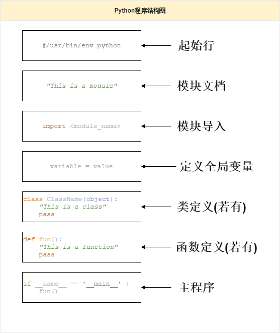

### `__name__`变量

为了区分主执行代码和被调用文件，Python引入了变量：`__name__`。

当文件是被调用时，`__name__`的值为模块名；

当文件被执行时，`__name__`的值为'`__main__`'。

例如：

```python
#hello.py
def sayHello():
    print("Hello,Python");

if __name__ == "__main__":
    print ('This is main of module "hello.py"')
    sayHello()
```

如果单独执行`hello.py`文件，输出结果：

> This is main of module "hello.py"
> Hello,Python

如果`hello.py`被引入其他文件，`if __name__=="__main__":`这一部分代码不会被执行。

例如：

```
#test.py
import hello
hello.__name__
```

输出结果：

> （结果为空）

这是因为在`test.py`中引用`hello.py`时，`__name__`的值发生了变化。

### Python包

> 包是一个包含多个模块的文件夹，本质上包也是模块，所以包中可以包含包。

在`Python2`中目录必须包含一个名为`__init__.py`的模块，Python才会将其视作是一个包。但在Python3中，`__init__.py`模块不是必须的。

#### Python库

库是一个更大的概念，每个库中含有若干个包，每个包中又含有若干个模块。

#### 创建包

包其实就是包含若干模块的文件夹，按照以下步骤手动创建一个包：

1. 新建一个文件夹，文件夹的名称就是包的名称。
2. 在该文件夹中，创建一个`__init__.py`文件。

例如：创建一个名为`my_package`的包

打开命令行窗口输入以下指令或者右键->新建来完成创建文件夹和创建文件的操作。

```shell
md my_package
cd my_package
type nul>__init__.py
```

由此一个Python包就创建完成了，可以向包中添加模块（或添加包）。

例如：我们将`hello.py`和`test.py`添加到`my_package`中。

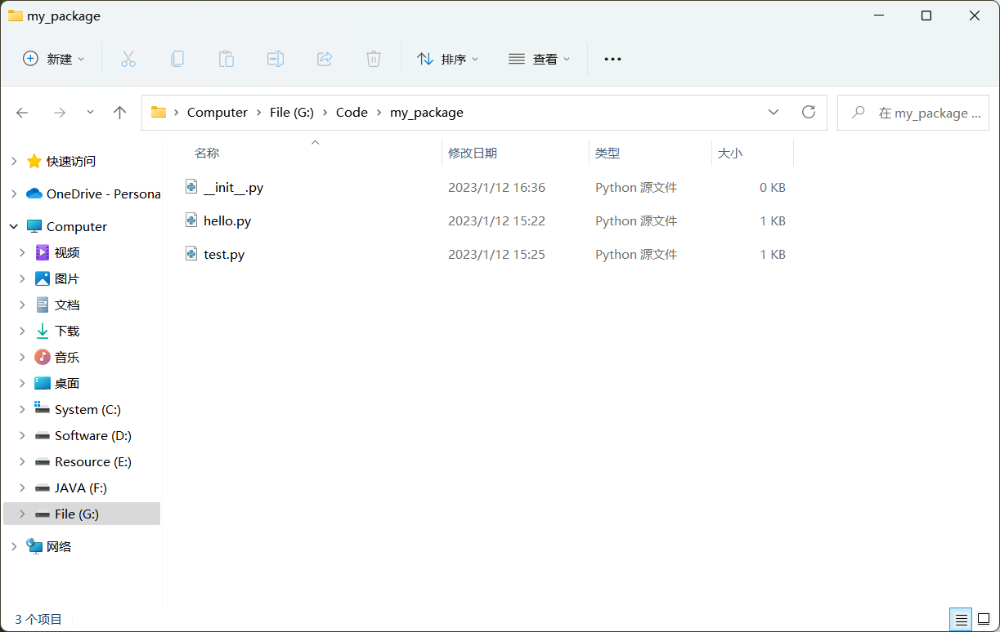

#### 导入包

包本质上是模块的集合，所以导入包就如同导入模块一样，使用`import`语句能够导入自定义的包或者下载的第三方包。

例如：导入`my_package`中的`hello`模块

```python
import my_package.hello
my_package.hello.sayHello()
```

输出结果：

> Hello,Python

从输出结果可以看到，`my_packege`中的hello模块在程序中被导入，然后调用了`sayHello()`方法，输出了`"Hello，Python"`。

同时在包中自动生成了一个`__pycache__`文件夹：

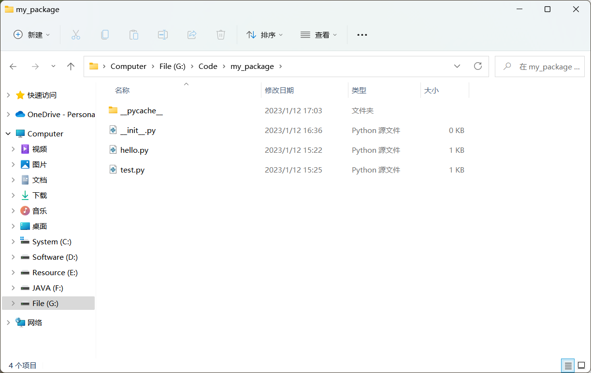

在`__pycache__`文件夹存放了两个文件：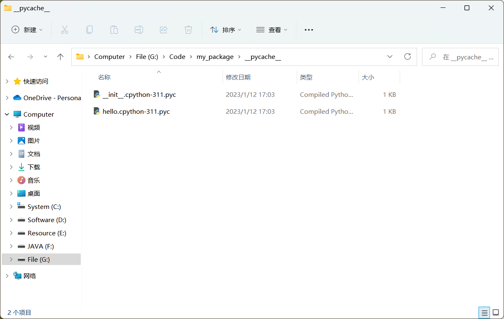

`__init__.cpython-311.pyc`和`hello.cpython-311.pyc`就是经过Python解释器解释的`.pyc`文件。

直接导入包名，并不会将包中所有模块全部导入到程序中，它的作用仅仅是导入并执行包下的 `__init__.py` 文件。

例如：仅运行以下代码，就不会生成`hello.cpython-311.pyc`。

```python
import my_package
```

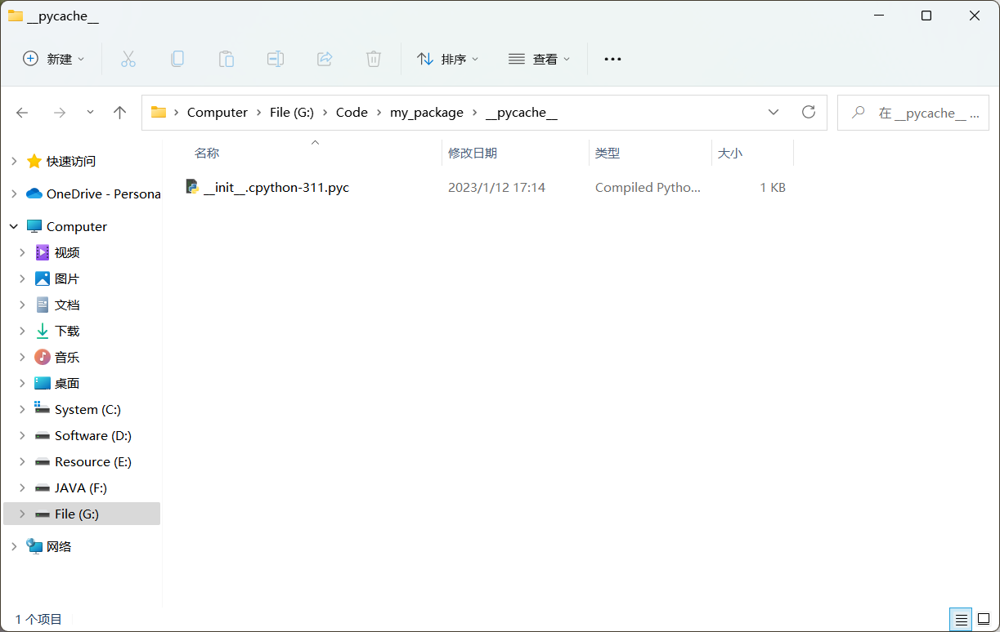

#### 自动加载模块

使用`__all__`变量指定导入包时将自动加载的模块。

例如：将`__init__.py`修改成以下代码,并新建一个`main.py`写入如下代码。

```python
# __init__.py

__all__ = [
    'hello',
    'test'
]
```

```python
#main.py
from my_package import *
hello.sayHello()
```

输出结果：

> Hello,Python

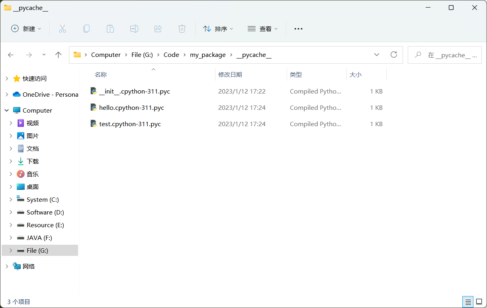

可以看到`hello.py`，`test.py`已经自动导入了。

## 文件输入/输出

### 读取文本文件

在Python中读取文本文件的步骤如下：

1. 使用`open()`函数打开一个文本文件进行读取
2. 使用`file`或`file`对象的`read()`、`readline()`、`readlines()`方法从文本文件中读取
3. 使用`file`的`close()`方法关闭文件

#### open()函数

`open()`函数用于打开一个文件，创建一个`file`对象。

语法如下：

```
open(name[,mode[,buffering]])
```

`name`：访问文件路径的字符串。

`mode`：打开文件的模式。

`buffering`：值为0时不寄存，值为1时访问文件会寄存行，值为大于1的整数时是寄存区的缓冲大小，取负值时为系统默认的缓冲大小。

要打开`UTF-8`文本文件，需要向`open()`方法传递`endcoding='utf-8'`参数。

打开文本文件的模式主要有：

| 模式 | 描述                                                         |
| ---- | ------------------------------------------------------------ |
| `t`  | 文本模式（默认）                                             |
| `r`  | 只读模式，只能读不能写，文件不存在时报错。                   |
| `w`  | 只能写不能读，文件存在时清空内容再写，文件不存在时先创建文件后再写。 |
| `+`  | 打开一个文件进行更新，可读可写。                             |
| `a`  | 打开一个用于追加的文件，文件存在，则在文件末端写入内容；文件不存在时会创建文件后写入内容。 |
| `x`  | 写模式，新建一个文件，如果文件存在则报错。                   |
| `b`  | 二进制模式                                                   |

注意：`t`、`b`模式均不能单独使用，都需要与`r`/`w`/`a`之一连用。

例如：打开文件名为`README.txt`、与程序存储在同一文件夹的文件。

```python
read_file = open('README.txt','r')
```

#### 阅读文本方法

| 方法名              | 描述                                     |
| ------------------- | ---------------------------------------- |
| `read([size])`      | 将文件中的所有文本读入字符串             |
| `readline()`        | 将文件中的所有文本读入字符串返回         |
| `readlines([size])` | 读取文本文件的所有行并作为字符串列表返回 |

#### close()方法

打开的文件将保持打开状态，直到使用`close()`方法关闭。

例如：关闭文件

```python
read_file.close()
```

要在不调用`close()`方法的情况下自动关闭文件，请使用`with`语句。

语法如下：

```python
with open(file_path) as new_name:
	variable = new_name.readlines()
```

例如：不调用`close()`方法的情况下自动关闭`README.txt`文件。

```python
with open('README.txt') as f:
	read_file = f.readlines()
```

实例：打开当前文件夹下保存有《远和近》的`README.txt`文件，并读取其内容。

```python
read_file = []
with open('README.txt',encoding='utf-8') as f:
    read_file = f.readlines()
#以列表形式输出
print(read_file)
#仅输出行数和内容
count = 0
for i in read_file:
    count += 1
    print(f"line{count}:",i,end='')
```

输出结果：

> ['《远和近》\n', '你，\n', '一会看我，\n', '一会看云。\n', '我觉得，\n', '你看我时很远，\n', '你看云时很近。']
> line1: 《远和近》
> line2: 你，
> line3: 一会看我，
> line4: 一会看云。
> line5: 我觉得，
> line6: 你看我时很远，
> line7: 你看云时很近。

#### for循环读取文本

`open()`函数返回一个文件对象，它是一个可迭代对象，因此可以使用`for`循环来遍历文本文件的所有行。

例如：

```python
with open('README.txt',encoding='utf-8') as f:
	for line in f:
		print(line,end="")
```

输出结果：

> 《远和近》
> 你，
> 一会看我，
> 一会看云。
> 我觉得，
> 你看我时很远，
> 你看云时很近。

### 写入文本文件

在Python中写入文本文件的步骤如下：

1. 使用`open()`函数打开文本文件
2. 使用`write()`方法或`writelines()`方法写入文本文件
3. 使用`close()`方法关闭文件

`open()`方法和`close()`方法在读取文本文件中介绍过。

#### 写入文本方法

| 方法名       | 描述                                 |
| ------------ | ------------------------------------ |
| write()      | 将一个字符串写入文本文件             |
| writelines() | 一次将字符串列表、字符串元组写入文件 |

例如：将`lines`写入`hello.txt`。

```python
lines = ['Hello','World']
with open('hello.txt','w',encoding='utf-8') as f:
	for line in lines:
		f.write(line)
		f.write('\n')
#为了方便看到现象，对写入的文件进行读取。
with open('hello.txt','r',encoding='utf-8') as f2:
	for line in f2:
		print(line,end='')
```

输出结果：

> Hello
> World

### 检查文件是否存在

对文件进行操作之前，可以对`os.path`模块中的`exists()`函数或`pathlib`模块中的is_file()方法。

#### os.path.exists()函数

```python
#从os.path中导入exists
from os.path import exists
#调用exists()函数并赋值给file_exists
file_exists = exists(file_path)
#file_path必须是完整的文件路径名
```

#### Path.is_file()方法

```python
#从pathlib中导入Path
from pathlib import Path
#实例化一个Path类型的对象
path = Path(file_path)
#调用path对象的is_file()方法
path.is_file()
```

如果文件存在，则`exists()`函数、`is_file()`方法返回`True`，否则返回`False`。

实例：使用`exists()`函数检查`README.txt`文件是否存在

```python
from os.path import exists
file_exists = exists('README.txt')
print(file_exists)
```
输出结果：
> True

实例：使用`is_path()`方法检查`README.txt`文件是否存在

```python
from pathlib import Path
path_file = 'README.txt'
path = Path(path_file)
if path.is_file():
	print(f"文件{path_file}存在")
else:
	print(f"文件{path_file}不存在")
```

输出结果：

> 文件README.txt存在

### 读取csv文件

#### CSV文件

`.csv`文件时一种特殊格式的纯文本文件，即是一组字符序列，字符之间以英文的逗号（`,`）或制表符（`Tab`）分隔开。

| fruit_name | fruit_price | quantity |
| ---------- | ----------- | -------- |
| apple      | 5           | 4        |
| banana     | 4           | 2        |
| orange     | 3           | 3        |

#### 使用CSV模块读取csv文件

在Python中使用`csv`模块读取`csv`文件中的步骤如下：

1. 导入`csv`模块
2. 使用`open()`函数打开`csv`文件，如果包含`UTF-8`字符，需要指定编码`encoding='utf-8'`。
3. 使用`reader()`函数，将文件对象作为参数传入。

例如：

```python
import csv
with open('myCsv.csv',encoding = 'utf-8-sig') as open_file:
    csv_reader = csv.reader(open_file)
    for line in csv_reader:
        print(line)
```

输出结果：

> ['fruit_name', 'fruit_price', 'quantity']
> ['apple', '5', '4']
> ['banana', '4', '2']
> ['orange', '3', '3']

可以使用`enumerate()`函数获取每行的索引，根据索引可以分离标题和数据。

例如：

```python
import csv
with open('myCsv.csv',encoding = 'utf-8-sig') as open_file:
    csv_reader = csv.reader(open_file)
    for info,line in enumerate(csv_reader,1):
        if info == 1:
            print("标题行",line)
        else:
            print(f"第{info}行",line)
```

输出结果：

> 标题行 ['fruit_name', 'fruit_price', 'quantity']
> 第2行 ['apple', '5', '4']
> 第3行 ['banana', '4', '2']
> 第4行 ['orange', '3', '3']

#### 使用DictReader类读取csv文件

使用`csv.reader()`函数访问`csv`文件时，通过索引值来访问对应的值，通常这些索引值不能直接体现数据的含义；而且如果列表的顺序发生了改变，你需要将代码中有关的索引值都进行更改。使用`DictReader`能够更好的处理上述问题，`DictReader`将每一行的信息映射到一个字典（`dict`），其键由第一行的值指定，这就意味着可以使用键的值来访问文件中的数据，而不是通过索引。

例如：

```python
import csv
with open('myCsv.csv',encoding = 'utf-8-sig') as open_file:
	csv_reader = csv.DictReader(open_file)
	for line in csv_reader:
		print(line['fruit_name'],line['fruit_price'])
```

输出结果：

> apple 5
> banana 4
> orange 3

### 写入csv文件

将数据写入`csv`文件中的步骤如下：

1. 使用`open()`函数，打开`csv`文件并进入写入模式。
2. 调用模块的`writer()`函数创建一个`writer`对象。
3. 调用`writerow()`方法或者`writerows()`方法将数据写入`csv`文件
4. 数据写入完成，关闭文件。

例如：

```python
import csv
header = ['fruit_name','fruit_price','quantity']
data = [['peach',5,2],
        ['pear',2,5],
        ['grape',9,2]]
with open('myCsv.csv', 'w', encoding='utf-8',newline='') as open_file:
    csv_writer = csv.writer(open_file)
    csv_writer.writerow(header)
    csv_writer.writerows(data)
    #为了方便看到现象，对写入的csv文件进行读取
with open('myCsv.csv','r',encoding='utf-8') as open_file:
    csv_reader = csv.reader(open_file)
    for line in csv_reader:
        print(line)
```

输出结果：

> ['fruit_name', 'fruit_price', 'quantity']
> ['peach', '5', '2']
> ['pear', '2', '5']
> ['grape', '9', '2']

从输出结果不难看出，写入的数据将原有所有的数据覆盖了。

#### 使用DictWriter类写入csv文件

同样的，可以使用`DictWriter`类的`csv`将字典写入`csv`文件中。

例如：

```python
import csv
header = ['fruit_name', 'fruit_price', 'quantity']
data = [
    {'fruit_name':'peach','fruit_price':5,'quantity':2},
    {'fruit_name':'grage','fruit_price':3,'quantity':1},
    {'fruit_name':'mango','fruit_price':5,'quantity':2}
]

with open('myCsv.csv', 'w', encoding = 'utf-8', newline='') as open_file:
    csv_writer = csv.DictWriter(open_file, fieldnames=header)
    csv_writer.writeheader()
    csv_writer.writerows(data)
    # 为了方便看到现象，对写入的csv文件进行读取
with open('myCsv.csv','r',encoding = 'utf-8') as open_file:
    csv_reader = csv.reader(open_file)
    for line in csv_reader:
        print(line)
```

输出结果：

> ['fruit_name', 'fruit_price', 'quantity']
> ['peach', '5', '2']
> ['grage', '3', '1']
> ['mango', '5', '2']

## 包

### 包索引(PyPI)

虽然Python的标准库提供了丰富的包，但有时候可能需要其他的包，[包索引](https://pypi.org/)是最大的Python存储库，它包含许多Python包，供开发者下载安装使用。

### 包管理工具(pip)

`pip`是Python的包管理工具，该工具提供了对Python包的查找、安装、卸载功能。

在`Windows`系统中，可以使用`pip`的以下命令，在`macOS`和`Linux`系统上需要将`pip`更改为`pip3`。

查看是否已经安装pip：

```shell
pip --version
```

下载安装包命令：

```shell
pip install <package_name>
```

卸载安装包命令：

```shell
pip uninstall <package_name>
```

查看已经安装的软件包：

```shell
pip list
```

查看包的有关信息：

```shell
pip show <package_name>
```

### Python虚拟环境

Python将所有系统包存储安装在指定的文件夹中，如果忘记了安装路径，可以通过以下代码找到：

```python
import sys
print(sys.prefix)
```

输出结果：（根据安装路径结果有所不同）

> D:\Python

在安装第三方包时，Python将这些包存储在`site.getsitepackages()`函数指定的不同文件夹中。

```python
import site
print(site.getsitepackages())
```

输出结果：（结果有所不同）

> ['D:\\Python', 'D:\\Python\\Lib\\site-packages']

由于只有一个位置存储第三方包，因此不同同时存储不同版本的库。在Python中，可以使用虚拟环境为每个项目创建隔离环境。

如果有多个项目使用不同版本的包，可以将它们分别存储在单独的文件夹（或虚拟环境）中。

Python3包含虚拟环境模块（`venv`）作为标准库，要为项目创建虚拟环境，需要使用`pipenv`工具。

### 安装pipenv

在安装`pipenv`之前，需要确保计算机上已经安装了Python环境。

安装步骤如下：

1. 使用`pip install pipenv`命令安装
2. 使用`pipenv -h`来检查`pipenv`是否正确安装

如果以下的输出，则需要检查环境变量是否正确配置：

```
pipenv shell 'pipenv' is not recognized as an internal or external command, operable program or batch file.
```

一般来说，在安装Python勾选了`Add python.exe to Path`就不需要手动配置环境变量了。

### 使用pipenv

通过以下命令创建一个名为`new_project`的项目文件夹，并在项目文件夹中安装`requests`包。

```shell
mkdir new_project
cd new_project
pipenv install requests
```

运行后发现，`pipenv`创建了两个文件，但虚拟环境的文件并不在此路径中。

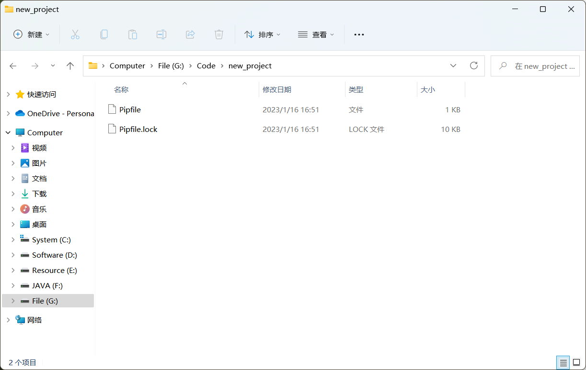

可以通过以下命令查找虚拟环境的位置：

```shell
pipenv --venv
```

输出结果：（结果会有差异）

> C:\Users\Xie\.virtualenvs\new_project-1mfXVFbZ

在项目文件夹中创建一个名为`new_file`的文件，并编写代码：

```python
#导入requests包
import requests
#使用get()函数向URL发出HTTP请求
response = requests.get('https://www.python.org/')
#输出状态码
print(response.status_code)
```

在终端通过以下命令运行`new_file`文件：

```python
python new_file.py
```

如果出现以下错误：

```shell
ModuleNotFoundError: No module named 'requests'
```

则需要使用以下命令激活虚拟环境：

```python
pipenv shell
```

再次运行`new_file`：

> 200

注：200表示HTTP请求已成功。

最后，使用`exit`命令退出虚拟环境。

## 面向对象编程

在Python中一切都是对象，对象具有状态和行为。要创建一个对象，首先要定义一个类，然后可以从中创建一个或多个类。对象是类的实例。

### 定义类

使用`class`关键字来定义一个类。语法如下：

```python
class 类名:
	pass
```

例如：定义一个`Person`类

```python
class Person:
	pass
```

要从类中创建对象，语法如下：

```python
对象名 = 类名()
```

例如：创建一个`Person`类的对象

```python
person = Person()
```

### 定义实例属性

Python是动态的，这意味着可以在运行时动态地将属性添加到类的实例中。

例如：将`name`属性添加到`person`对象中

```python
person.name = '王冰冰'
```

但是只有`person`对象拥有`name`这个属性，新对象不会拥有这一属性。

要为类的所有实例定义和初始化属性，需要使用`__init__`方法。

例如：下面定义了具有两个实例属性`name`和`age`的`Person`类

```python
class Person:
	def __init__(self, name, age):
		self.name = name
		self.age = age
```

创建Person对象时，Python会自动调用`__init__`方法来初始化实例属性，在`__init__`方法中，`self`是`Person`类的实例。

例如：创建一个`Person`类的对象`another_person`

```
another_person = Person('蔡徐坤',25)
```

### 定义实例方法

```python
class Person:
    def __init__(self,name,age):
        self.name = name
        self.age = age
    def sayHello(self):
        return f"你好,{self.name}!"
```

调用实例方法如下：

```python
another_person = Person('蔡徐坤',25)
print(another_person.sayHello())
```

输出结果：

> 你好,蔡徐坤!

### 定义类属性

与实例属性不同，类属性由类的所有实例共享。

例如：在`Person`类中定义`counter`属性

```python
class Person:
    counter = 0
    def __init__(self,name,age):
        self.name = name
        self.age = age
        Person.counter += 1
person = Person('王冰冰',33)
another_person = Person('蔡徐坤',25)
```

你可以从`Person`类或`Person`类的任何实例访问`counter`属性。

```python
#从Person类访问counter属性,并输出
print(Person.counter)
#从Person类的实例another_person访问counter属性，并输出
print(another_person.counter)
```

输出结果：

> 2
> 2

### 定义类方法

与类属性一样，类方法由类的所有实例共享，类方法的第一个参数`cls`是类本身。此外可以使用`@classmethod`装饰器来装饰类方法。

例如：定义了一个返回类名的`human_being()`方法

```python
class Person:
    counter = 0
    def __init__(self,name,age):
        self.name = name
        self.age = age
        Person.counter += 1
    @classmethod
    def human_being(cls):
        return "Person类"
#通过类名.类方法名来调用类方法
class_name = Person.human_being()
print(class_name)
```

输出结果：

> Person类

### 定义静态方法

静态方法不绑定到类或类的任何实例，在Python中，使用静态方法将逻辑相关的函数分组到一个类中，要定义静态方法，需要使用`@staticmethod`装饰器。

例如：

```
class UnitConversion:
    @staticmethod
    def meters_to_centimeters(m):
    
        return m * 10 ** 2
    @staticmethod
    def centimeters_to_meters(cm):
        return cm * 10 ** -2
test = UnitConversion.meters_to_centimeters(3.21)
print(test)
test = UnitConversion.centimeters_to_meters(520)
print(test)
```

输出结果：

> 321.0
> 5.2
